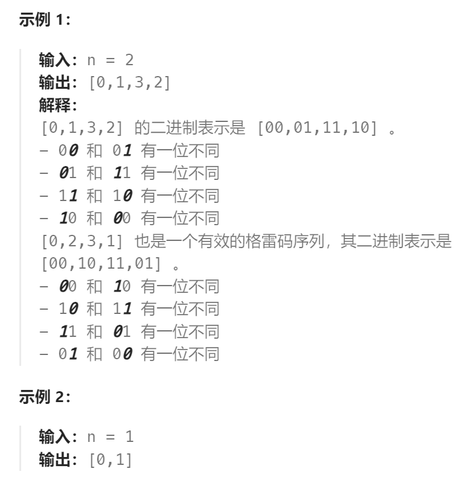
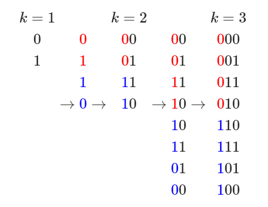
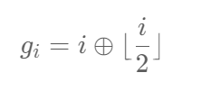

题目：

**n 位格雷码序列** 是一个由 `2^n` 个整数组成的序列，其中：

- 每个整数都在范围 `[0, (2^n) - 1]` 内（含 `0` 和 `(2^n) - 1`）
- 第一个整数是 `0`
- 一个整数在序列中出现 **不超过一次**
- 每对 **相邻** 整数的二进制表示 **恰好一位不同** ，且
- **第一个** 和 **最后一个** 整数的二进制表示 **恰好一位不同**

给你一个整数 `n` ，返回任一有效的 **n 位格雷码序列** 



题解：

**方法一：镜像构造格雷码**

`k `位的格雷码可以从`k-1`格雷码以上下镜射后加上新位的方式快速得到，如下图：



也就是说：假设我们知道长度为`k-1`位的格雷码构造，那么我们将这个**构造反转并拼在后面**，在这个**反转里每个数的二进制最左侧补上1**，就得到了长度为`k`位的格雷码构造。

```go
func grayCode(n int) []int {
    if n == 1 {
        return []int{0, 1}
    }
    // 递归获取所有 n-1 位的格雷码，add就是要为镜像序列追加的最左侧1
    res, add := grayCode(n-1), 1<<(n-1)    
    for i := len(res) - 1;i>=0;i--{   // 倒序遍历 n-1 长度的格雷码序列
        res = append(res, res[i] + add)  // 追加镜像序列，且镜像序列最左侧添加一个1
    }
    return res
}
```

**方法二：公式法**

格雷码也可以使用公式直接求出。第 i (i≥0) 个格雷码即为：



因为长度为n的格雷码序列总共有 2^n 个，因此我们可以采用上述公式从0开始进行构造：

```go
func grayCode(n int) []int {
    ans := make([]int, 1<<n)  // 1<<n 等价于 2^n
    for i := range ans {
        ans[i] = i>>1 ^ i    // i>>1 等价于 i/2
    }
    return ans
}
```

