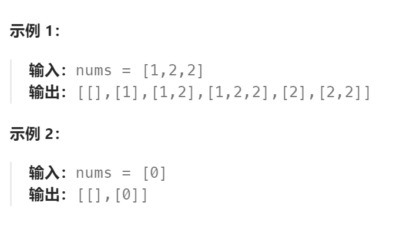

题目：

给你一个整数数组 `nums` ，其中可能包含重复元素，请你返回该数组所有可能的子集（幂集）。

解集 **不能** 包含重复的子集。返回的解集中，子集可以按 **任意顺序** 排列。



题解：

**方法一：每次递归为当前子集从`nums[]`中选择一个数值**

- 因为`num[]`中有重复的数值，因为要注意：为当前位选择一个数值时，不能选择重复的（在本次递归中用一个哈希表记录已经选过的数值）
- 在递归过程中，**上一次已经选过的元素(注意不是数值)**，就不能再重复选择了（已经选过的元素在`num[]`中标记为已读(`nums[i] = math.MinInt`)，递归完后再回溯）
- 如果一个子集满足：元素个数以及数值相等，只是顺序不同，那么这是一个子集。比如：[1,2] 和 [2,1] 就是一个子集。为了避免这种重复情况，将`nums[]`数组进行从小到大排序，然后每次递归时为当前位选择的数值 `curNum`必须满足：`curNum >= last`，`last`是上一轮递归选择的数值。

```go
func subsetsWithDup(nums []int) [][]int {
    res := [][]int{}
    curPath := []int{}

    var dfs func(int, int)

    dfs = func(last int,length int) {
        if len(curPath) == length {
            res = append(res, append([]int(nil), curPath...))
            return
        }
        haveSelect := make(map[int]bool)   // 记录本次递归中已经在curPath当前位上已经出现过的nums[]数值
        // 每次递归为curPath选择一位
        for i:=0; i<len(nums); i++ {
            curNum := nums[i]
            if curNum < last {   // 必须是单调递增, 即 curNum >= last。 ==是必要的，因为这是一个可以出现重复的 nums[] 数组
                continue
            }
         	// curNum >= last 中 == 的存在，导致必须有这一个过滤条件
            if curNum == math.MinInt {   // 已经选过的数字不能重复选
                continue
            }
            if haveSelect[curNum] {
                continue
            } else {
                haveSelect[curNum] = true
                curPath = append(curPath, curNum)
                tmp := nums[i]
                nums[i] = math.MinInt
                dfs(curNum ,length)
                curPath = curPath[:len(curPath)-1]
                nums[i] = tmp
            }
        }
    }
    sort.Ints(nums)
    for i:=0; i<=len(nums); i++ {
        dfs(nums[0]-1 ,i)
    }
    return res
}
```

**方法二：**

- 遍历整个 `nums[]`数组，每次轮到`nums[index]`，都可以分为：1.选择当前`nums[index] `    2.不选择当前`nums[index] `  
- 结束条件是： `index == len(nums)` 。也就是完成了对整个`nums`数组的遍历
- 对于 [选择] 分支， 其必须要保证产生的序列子集满足题目给的要求。但是此题目并未对序列子集有特殊要求，因此可以跳过
- 对于 [不选择] 分支，必须要保证不产生重复。只有当**当前的元素不等于上一个选择的元素的时候，才考虑不选择当前元素**，直接递归后面的元素。因为如果有两个相同的元素，我们会考虑这样四种情况：
  - 前者被选择，后者被选择
  - **前者被选择，后者不被选择**
  - **前者不被选择，后者被选择**
  - 前者不被选择，后者不被选择

其中第二种情况和第三种情况其实是等价的，我们这样限制之后，**舍弃了第二种，保留了第三种**，于是**达到了去重的目的**。

- 最后一点：通过上述的回溯算法，我们得到的所有子集中，包括了：所有的递增序列子集和所有的递减序列子集。但是，从集合的角度考虑：[1,4]和[4,1] 其实是一对重复的子集，只不过一个递增，一个递减。为了消除这种重复性，在进行回溯算法之前，先对`nums`数组进行排序，这样就只会得到递增序列子集（因为 `nums[index + 1]` 必然大于等于 `nums[index]`）

```go
func subsetsWithDup(nums []int) [][]int {
    res := [][]int{}
    curPath := []int{}

    sort.Ints(nums)

    var dfs func(int, int)

    dfs = func(index int, last int) {
        if index == len(nums) {
            res = append(res, append([]int(nil), curPath...))
            return
        }
        if nums[index] != last {
            dfs(index+1, last)  // 不选择当前nums[i]
        }

        curPath = append(curPath, nums[index])
        dfs(index+1, nums[index])
        curPath = curPath[:len(curPath)-1]
    }
    
    dfs(0, math.MinInt)   // 初始时，"上一个被选择的元素"被设置为 math.MinInt这样一个不存在于nums[]中的数值
    

    return res
}
```

#### 另一种针对 `[选择]` 分支的去重策略：

**一般情况下，不会在选择分支进行去重策略**。如果在选择分支使用了，必须是**当选择分支没有设置序列合法策略。**因为同时在选择分支设置去重策略和合法策略，可能会产生冲突。

保留第二种，舍弃第三种。即：选择当前分支，当且仅当上一个不被选择的元素与自己不相等。

**注意这两种去重策略对于`last`的设置。**

```go
func subsetsWithDup(nums []int) [][]int {
    res := [][]int{}
    curPath := []int{}

    sort.Ints(nums)

    var dfs func(int, int)

    dfs = func(index int, last int) {
        if index == len(nums) {
            res = append(res, append([]int(nil), curPath...))
            return
        }
        
        dfs(index+1, nums[index])  // 不选择当前nums[i]
        
        if last != nums[index] {
            curPath = append(curPath, nums[index])
            dfs(index+1, last)
            curPath = curPath[:len(curPath)-1]
        }

    }
    
    dfs(0, math.MinInt)
    

    return res
}
```

- 特殊的，因为`nums[]`数组实现进行了排序，因此：**两个相等的数字一定是相邻的**
- 因此，我们的递归变量可以不使用 `int`型的 `last`，而是可以使用一个`bool`变量。
- 用来在`nums[i]`所在的递归轮次提供`nums[i-1]`是否被选择的信息。
- 当且仅当上一个`num[i-1]`没有被选择，且当前`num[i] == num[i-1]`时，不能选择`num[i]`

```go
func subsetsWithDup(nums []int) (ans [][]int) {
    sort.Ints(nums)
    t := []int{}
    var dfs func(bool, int)
    dfs = func(choosePre bool, cur int) {
        if cur == len(nums) {
            ans = append(ans, append([]int(nil), t...))
            return
        }
        dfs(false, cur+1)
        if !choosePre && cur > 0 && nums[cur-1] == nums[cur] {
            return
        }
        t = append(t, nums[cur])
        dfs(true, cur+1)
        t = t[:len(t)-1]
    }
    dfs(false, 0)
    return
}
```

