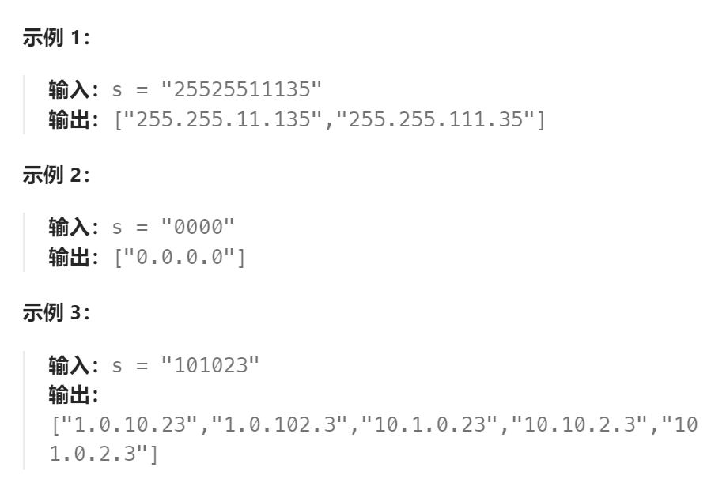
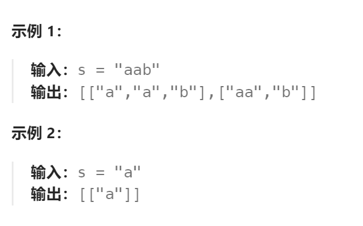
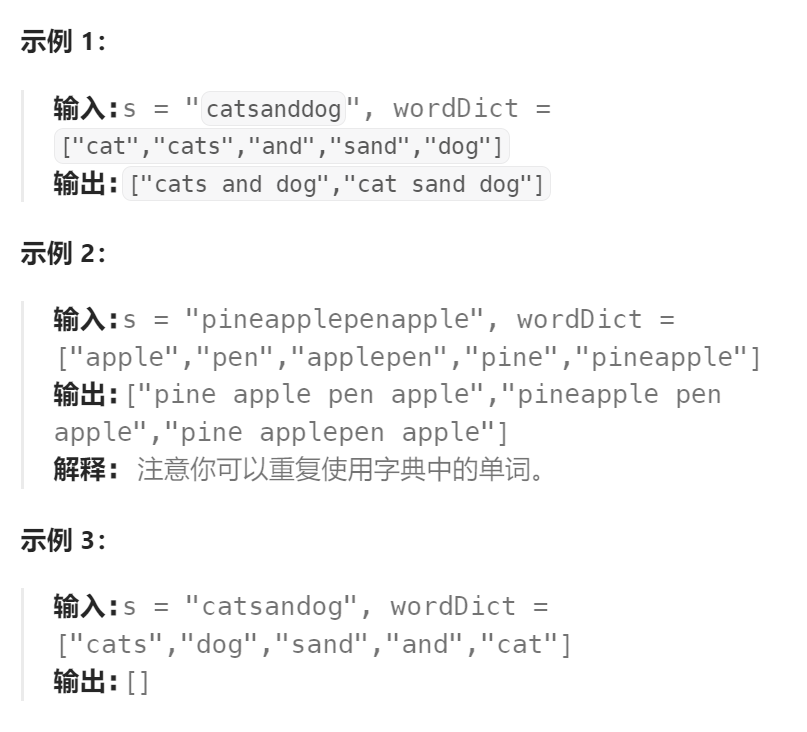

题目：

**有效 IP 地址** 正好由四个整数（每个整数位于 `0` 到 `255` 之间组成，且不能含有前导 `0`），整数之间用 `'.'` 分隔。

- 例如：`"0.1.2.201"` 和` "192.168.1.1"` 是 **有效** IP 地址，但是 `"0.011.255.245"`、`"192.168.1.312"` 和 `"192.168@1.1"` 是 **无效** IP 地址。

给定一个只包含数字的字符串 `s` ，用以表示一个 IP 地址，返回所有可能的**有效 IP 地址**，这些地址可以通过在 `s` 中插入 `'.'` 来形成。你 **不能** 重新排序或删除 `s` 中的任何数字。你可以按 **任何** 顺序返回答案。



题解：

```go
func restoreIpAddresses(s string) []string {
    res := []string{}
    curIP := make([]int, 4)  // 记录当前路径的IP
    
    var dfs func(int, int)
    // 每次生成IP地址四段中的一段
    dfs = func(IPSeg int, sStart int) {   // IPSeg表示当前正在合成第几段IP，sStart表示当前在s的哪一位上
        if IPSeg == 4 {   // 已经凑齐四段IP(0 1 2 3)
            if sStart == len(s) {   // 同时已经遍历完整个s字符串
                IPStr := ""
                for index,IP := range curIP {
                    IPStr += strconv.Itoa(IP)
                    if index != 3 {
                        IPStr += "."
                    }
                }
                res = append(res, IPStr)
                return
            } else {    // 已经合成了四段IP，但还没有遍历完整个s,那么当前合成路线是错误的
                return
            }
        }
        if sStart == len(s) {   // 已经遍历完s,但是还没有合成四段IP,则合成路线错误
            return
        }
        if s[sStart] == '0' {   // 当前位置是0，那么只能自己作为IP的一段(不需要回溯,因为只有这一种可能)
            curIP[IPSeg] = 0
            dfs(IPSeg+1, sStart+1)
            return
        }
        // 当前位置不为0，可以选择: 1.一位合成  2.两位合成  3.三位合成  
        // 原则是:合成的数值要小于等于255,且对s的访问不能越界
        addr := 0
        for sEnd := sStart; sEnd < len(s); sEnd++ {   // 对s不能访问越界
            addr = addr * 10 + int(s[sEnd] - '0')
            if addr <= 255 {   // 数值小于等于255, 可以作为合法的一段IP, 进行递归
                curIP[IPSeg] = addr
                dfs(IPSeg+1, sEnd+1)
            }
        }

    }
    dfs(0, 0)
    return res
}
```


### 同一解题思路的题目：

#### 1.`131.分割回文串`

题目：

给你一个字符串 `s`，请你将 `s` 分割成一些子串，使每个子串都是 **回文串** 。返回 `s` 所有可能的分割方案。

**回文串** 是正着读和反着读都一样的字符串。




题解：

```go
func partition(s string) [][]string {
    res := [][]string{}
    curPath := []string{}

    var dfs func(int)
    dfs = func(sStart int) {
        if sStart == len(s) {
            res = append(res, append([]string(nil), curPath...))
            return
        }
        str := []byte{}
        for sEnd := sStart; sEnd < len(s); sEnd++ {
            str = append(str, s[sEnd])
            if huiwen(str) {   // 判断是否是回文字符串
                curPath = append(curPath, string(str))   // 记录这个回文字符串
                dfs(sEnd+1)
                // 回溯
                curPath = curPath[:len(curPath)-1]
            }
        }
    }
    dfs(0)
    return res
}

func huiwen(str []byte) bool {
    if len(str) <= 1 {
        return true
    }
    head := 0
    tail := len(str) - 1

    for {
        if head >= tail {
            return true
        }
        if str[head] != str[tail] {
            return false
        }
        head++
        tail--
    }
}
```


#### 2. `140.单词拆解II`

题目：

给定一个字符串 `s` 和一个字符串字典 `wordDict` ，在字符串 `s` 中增加空格来构建一个句子，使得句子中所有的单词都在词典中。**以任意顺序** 返回所有这些可能的句子。

**注意：**词典中的同一个单词可能在分段中被重复使用多次。



题解：

```go
func wordBreak(s string, wordDict []string) []string {

    res := []string{}
    curPath := []string{}  // 当前路径搜集的单词

    wordMap := make(map[string]bool)  // 便于查询单词
    for _,word := range wordDict {
        wordMap[word] = true
    }
    var dfs func(int)

    dfs = func(index int) {
        if index == len(s) {   // 遍历完整个原始字符串
            str := ""
            for index, word := range curPath {
                str += word
                if index < len(curPath) -1 {
                    str += " "
                }
            }
            res = append(res, str)
            return
        }
        curWord := []byte{}
        for sEnd := index; sEnd < len(s); sEnd++ {
            curWord = append(curWord, s[sEnd])
            if wordMap[string(curWord)] {
                curPath = append(curPath, string(curWord))
                dfs(sEnd + 1)
                curPath = curPath[:len(curPath)-1]
            }
        }
    } 
    dfs(0)
    return res
}
```

