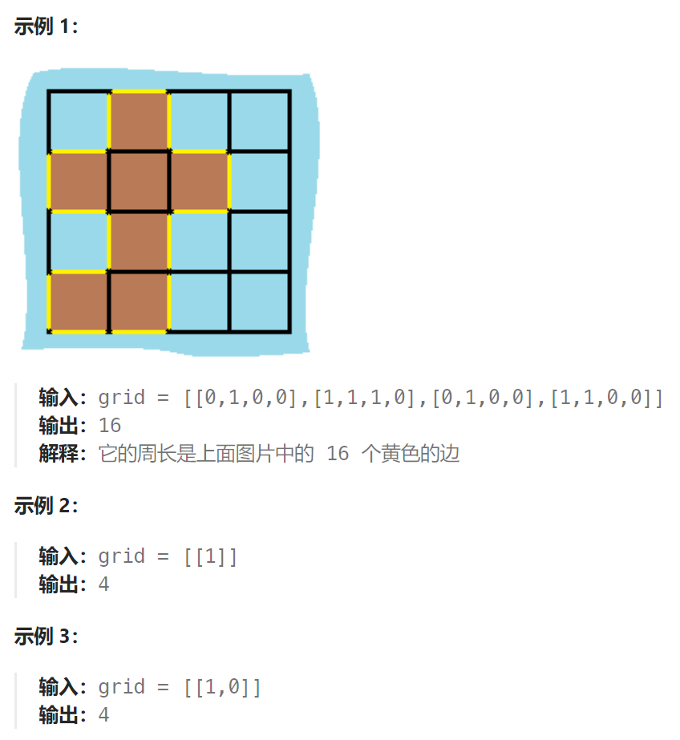

## 题目

给定一个 `row x col` 的二维网格地图 `grid` ，其中：`grid[i][j] = 1` 表示陆地， `grid[i][j] = 0` 表示水域。

网格中的格子 **水平和垂直** 方向相连（对角线方向不相连）。整个网格被水完全包围，但其中恰好有一个岛屿（或者说，一个或多个表示陆地的格子相连组成的岛屿）。

岛屿中没有“湖”（“湖” 指水域在岛屿内部且不和岛屿周围的水相连）。格子是边长为 1 的正方形。网格为长方形，且宽度和高度均不超过 100 。计算这个岛屿的周长。



## 题解

遍历每一个空格，遇到岛屿，计算其上下左右的情况，遇到水域或者出界的情况，就可以计算边了。

```go
func islandPerimeter(grid [][]int) int {
    rowMax, colMax := len(grid), len(grid[0])

    var dfs func(int, int) int
    dfs = func(row, col int) int {  
        if row < 0 || row >= rowMax || col < 0 || col >= colMax {  // 越界
            return 1
        }
        if grid[row][col] == 0 {   //  遇到水格子
            return 1
        }
        if grid[row][col] == -1 {   // 遇到已经走过的陆地格子
            return 0
        }
        grid[row][col] = -1   // 走过的陆地格子需要标记

        leftR := dfs(row-1, col)  // 左边
        rightR := dfs(row+1, col) // 右边
        upR := dfs(row, col-1)  // 上边
        downR := dfs(row, col+1)  // 下边

        curRound := leftR + rightR + upR + downR
        return curRound
    }

    for row := 0; row < rowMax; row++ {
        for col := 0; col < colMax; col++ {
            if grid[row][col] == 1 {
               return dfs(row, col)
            }
        }
    }
    return -1
}
```

