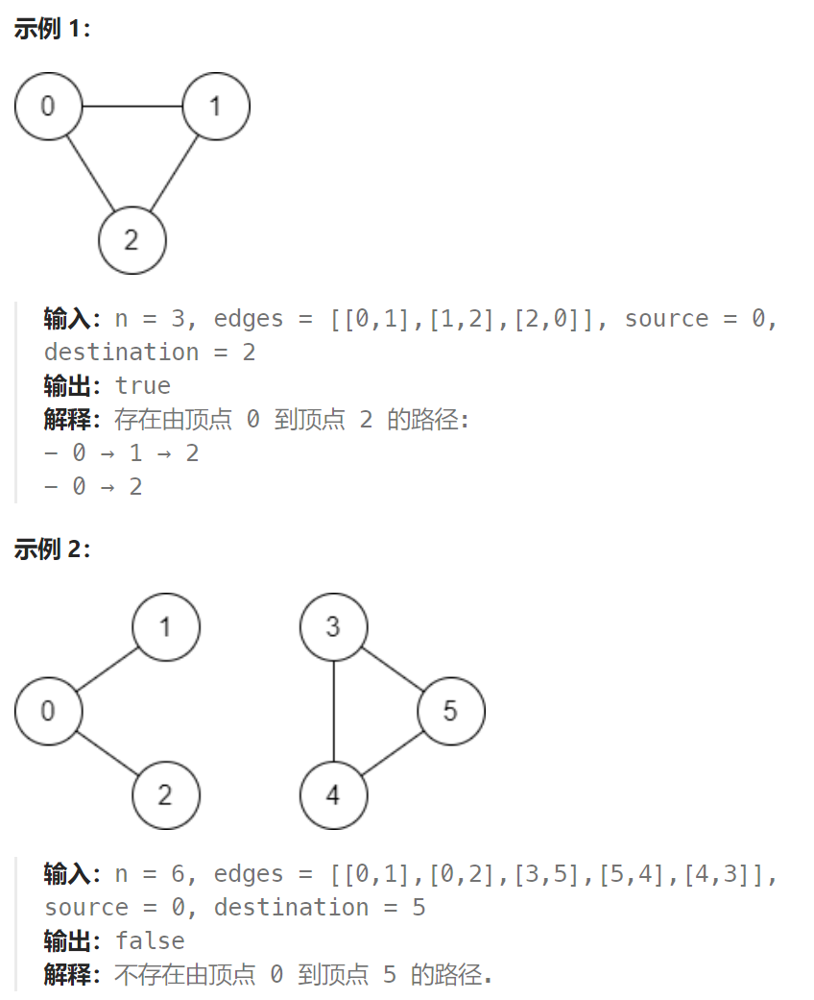

## 题目

有一个具有 `n` 个顶点的 **双向** 图，其中每个顶点标记从 `0` 到 `n - 1`（包含 `0` 和 `n - 1`）。图中的边用一个二维整数数组 `edges` 表示，其中 `edges[i] = [ui, vi]` 表示顶点 `ui` 和顶点 `vi` 之间的双向边。 每个顶点对由 **最多一条** 边连接，并且没有顶点存在与自身相连的边。

请你确定是否存在从顶点 `source` 开始，到顶点 `destination` 结束的 **有效路径** 。

给你数组 `edges` 和整数 `n`、`source` 和 `destination`，如果从 `source` 到 `destination` 存在 **有效路径** ，则返回 `true`，否则返回 `false` 。



## 题解

需要根据给定的边集合形成一个图，因此想到并查集。

基于并查集实现，通过遍历边集合 edges，形成若干点集合，最后检查 source 和 destination 是否在同一个集合即可判断。

```go
func validPath(n int, edges [][]int, source int, destination int) bool {
    father := Init(n)  // 
    for i := 0; i < len(edges); i++ {
        edge := edges[i]
        join(edge[0], edge[1], &father)   // 将一条边相连的两个节点加入到同一个集合
    }
    return isSameSet(source, destination, &father)
}

func Init(n int) []int {
    father := make([]int, n)  // 并查集底层数组
    for i := 0; i < len(father); i++ {
        father[i] = i
    }
    return father
}

// 返回节点 n 所在集合的特征节点
func find(n int, father *[]int) int {
    if (*father)[n] == n {
        return n
    } else {
        (*father)[n] = find((*father)[n], father)  // 路径压缩
        return (*father)[n]
    } 
}

func isSameSet(u, v int, father *[]int) bool {
    uFeather := find(u, father)
    vFeather := find(v, father)

    return uFeather == vFeather
}
// u 所在集合的特征节点 指向 v 所在集合的特征节点
func join(u, v int, father *[]int) {
    uFeather := find(u, father)
    vFeather := find(v, father)

    if uFeather == vFeather {
        return 
    } else {
        (*father)[uFeather] = vFeather
    }
}
```

