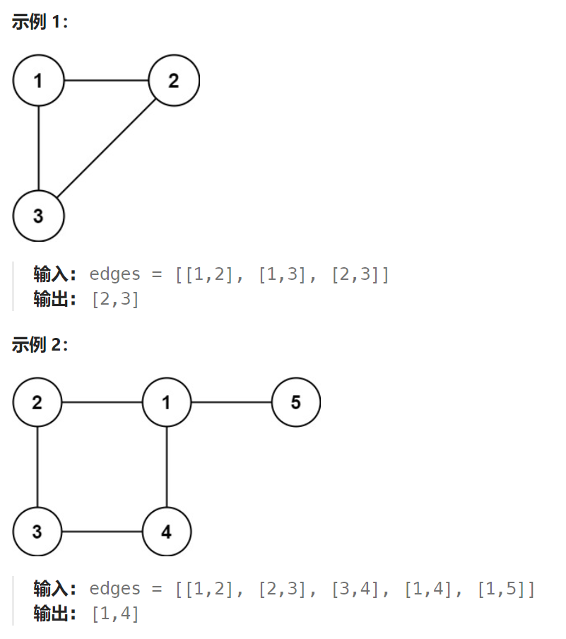

## 题目

树可以看成是一个连通且 **无环** 的 **无向** 图。

给定往一棵 `n` 个节点 (节点值 `1～n`) 的树中**添加一条边**后的图。添加的边的两个顶点包含在 `1` 到 `n` 中间，且这条附加的边不属于树中已存在的边。图的信息记录于长度为 `n` 的二维数组 `edges` ，`edges[i] = [ai, bi]` 表示图中在 `ai` 和 `bi` 之间存在一条边。

请找出一条可以删去的边，删除后可使得剩余部分是一个有着 `n` 个节点的树。如果有多个答案，则返回数组 `edges` 中最后出现的那个。



## 题解

此题也用并查集解决：遍历每一条给定的边，如果边两边的节点并非属于同一个集合，则进行相合并；如果两边的节点已经属于同一个集合，说明这条边就是冗余边。

只需在并查集模板上，修改合并函数 union，增加返回值说明本次合并到底是否生效即可。

```go
func findRedundantConnection(edges [][]int) []int {
    n := len(edges)   // 二叉树节点数量
    mt := NewMT(n)  // 构建并查集
    useless := make([][]int, 0)   // 存储所有无用的边
    for i := 0; i < len(edges); i++ {
        edge := edges[i]
        if !mt.union(edge[0], edge[1]) {  // 合并并没有生效, 两个节点本就是相连的，这是一条无用边
            useless = append(useless, edge)
        }
    }
    if len(useless) == 0 {
        return []int{}
    } else {
        return useless[len(useless)-1]
    }
}

type mergeT struct {
    father []int
}

func NewMT(node int) *mergeT {
    father := make([]int, node+1)   // 节点值从 1~n, 0 并未使用, 因此数组大小应该是 n+1
    for i := 0; i < len(father); i++ {
        father[i] = i
    }
    return &mergeT{
        father: father,
    }
}

// 返回节点n所在集合的特征节点 + 路径压缩
func (mt *mergeT) find(n int) int {
    if mt.father[n] == n {
        return n
    } else {
        mt.father[n] = mt.find(mt.father[n])
        return mt.father[n]
    }
}

func (mt *mergeT) isSameSet(u, v int) bool {
    uF := mt.find(u)
    vF := mt.find(v)

    return uF == vF
}
// 合并 u 和 v 所在集合，让 uF 的父节点为 vF
func (mt *mergeT) union(u, v int) bool {   // 返回值表示合并是否真正有效
    uF := mt.find(u)
    vF := mt.find(v)

    if uF == vF {
        return false  // u 和 v 本来就已经是同一集合的, 合并实际并未生效
    } else {
        mt.father[uF] = vF
        return true
    }
}
```

