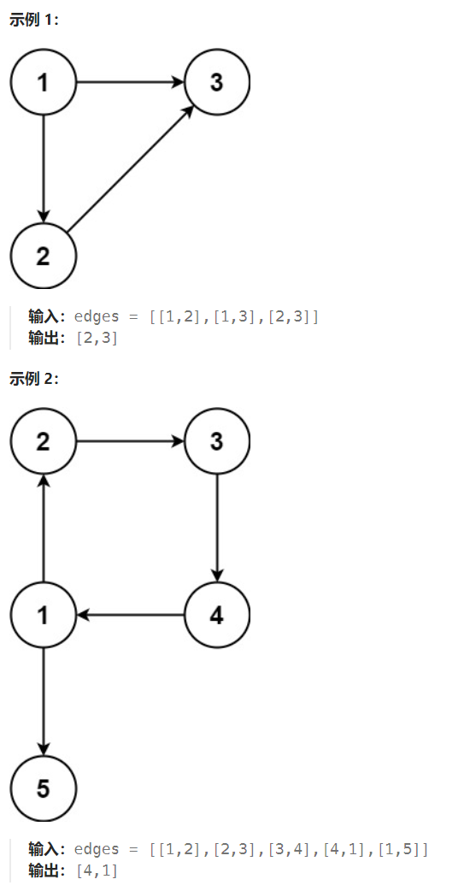

## 题目

在本问题中，有根树指满足以下条件的 **有向** 图。该树只有一个根节点，所有其他节点都是该根节点的后继。该树除了根节点之外的每一个节点都有且只有一个父节点，而根节点没有父节点。

输入一个有向图，该图由一个有着 `n` 个节点（节点值不重复，从 `1` 到 `n`）的树及一条附加的有向边构成。附加的边包含在 `1` 到 `n` 中的两个不同顶点间，这条附加的边不属于树中已存在的边。

结果图是一个以边组成的二维数组 `edges` 。 每个元素是一对 `[ui, vi]`，用以表示 **有向** 图中连接顶点 `ui` 和顶点 `vi` 的边，其中 `ui` 是 `vi` 的一个父节点。

返回一条能删除的边，使得剩下的图是有 `n` 个节点的有根树。若有多个答案，返回最后出现在给定二维数组的答案。



## 题解

树中的每个节点都有一个父节点，除了根节点没有父节点。在多了一条附加的边之后，可能有以下两种情况：

- 附加的边指向根节点，则包括根节点在内的每个节点都有一个父节点，此时图中一定有环路；

- 附加的边指向非根节点，则恰好有一个节点（即被附加的边指向的节点）有两个父节点，此时图中可能有环路也可能没有环路。


我们不能仅以"是否存在环路"为目标进行判断，因为在情况二中，即使没有环路也会导致有向树出现冗余边。

因此思路如下：

1. 检查树中是否有节点的入度为2（有两个父节点），如果有，则冗余边必定是其中一条
2. 如果没有入度为2的节点，则只会是第一种情况，我们只需要按照检查无向图是否存在冗余边的方式检测即可。

```go
// 冗余的边会导致有根树变成以下两种状态中的一种: 
// 1. 某节点入度 == 2(两个父节点),可能会有环    2.所有节点入度都是1，形成有向环（根节点不应该有父节点）
func findRedundantDirectedConnection(edges [][]int) []int {
    n := len(edges)   // 二叉树节点数量
    // 1.统计每个节点的入度(当一个节点的入度 == 2时为异常现象, 因为有根树中每个节点只能有一个父节点)
    degree := make([]int, n+1)   // 1~n, 0不使用
    for i := 0; i < len(edges); i++ {
        edge := edges[i]
        end := edge[1]
        degree[end]++
    }
    // 2.再次遍历边数组，找出入度 == 2节点的两条边
    twoEdges := make([][]int, 0)
    for i := 0; i < len(edges); i++ {
        end := edges[i][1]
        if degree[end] == 2 {
            twoEdges = append(twoEdges, edges[i])
        }
    }
    // 3.如果有入度为2的节点，那么一定是两条边里删一个，看删哪个可以构成树(不会构成环)。如果都没有环，删除后一条边
    if len(twoEdges) != 0 {
        // 优先检验并删除后面出现的边
        if isTreeAfterRemoveEdge(edges, twoEdges[1]) {  // 删除第二条边后依旧可以构成树
            return twoEdges[1]  // 说明第二条边是重复的
        } else {   // 删除第二条边不管用，会出现环
            return twoEdges[0]
        }
    }
    // 4.如果不是情况一，必定是情况二，接下来解决情况二
    // 遍历所有边，通过并查集构成图，查找出冗余的边，返回最后一个
    return findRedundantConnection(edges)

}

func isTreeAfterRemoveEdge(edges [][]int, remove []int) bool {
    mt := NewMT(len(edges))

    for i := 0; i < len(edges); i++ {
        edge := edges[i]
        if edge[0] == remove[0] && edge[1] == remove[1] {
            continue
        }
        flag := mt.union(edge[0], edge[1])
        if !flag {   // 出现冗余边
            return false
        }
    }
    return true
}

func findRedundantConnection(edges [][]int) []int {
    mt := NewMT(len(edges))
    useless := make([][]int, 0)

    for i := 0; i < len(edges); i++ {
        edge := edges[i]
        if !mt.union(edge[0], edge[1]) {  // 出现冗余边
            useless = append(useless, edge)
        }
    }
    return useless[len(useless)-1]   // 返回最后一条冗余边
}


type mergeT struct {
    father []int
}

func NewMT(node int) *mergeT {
    father := make([]int, node+1)   // 节点值从 1~n, 0 并未使用, 因此数组大小应该是 n+1
    for i := 0; i < len(father); i++ {
        father[i] = i
    }
    return &mergeT{
        father: father,
    }
}

// 返回节点n所在集合的特征节点 + 路径压缩
func (mt *mergeT) find(n int) int {
    if mt.father[n] == n {
        return n
    } else {
        mt.father[n] = mt.find(mt.father[n])
        return mt.father[n]
    }
}

func (mt *mergeT) isSameSet(u, v int) bool {
    uF := mt.find(u)
    vF := mt.find(v)

    return uF == vF
}
// 合并 u 和 v 所在集合，让 vF 的父节点为 uF
func (mt *mergeT) union(u, v int) bool {   // 返回值表示合并是否真正有效
    uF := mt.find(u)
    vF := mt.find(v)

    if uF == vF {
        return false  // u 和 v 本来就已经是同一集合的, 合并实际并未生效
    } else {
        mt.father[vF] = uF
        return true
    }
}
```

