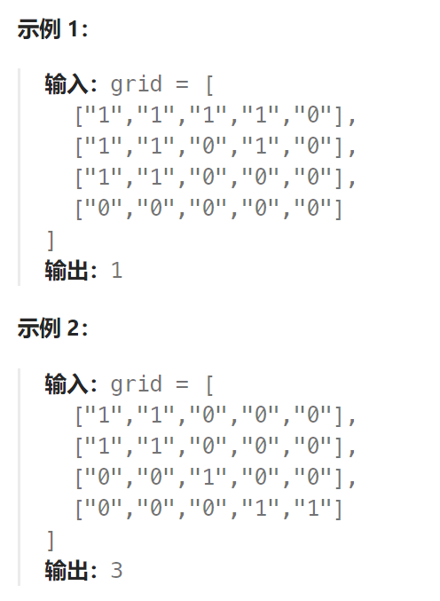

## 题目

给你一个由 `'1'`（陆地）和 `'0'`（水）组成的的二维网格，请你计算网格中岛屿的数量。

岛屿总是被水包围，并且每座岛屿只能由水平方向和/或竖直方向上相邻的陆地连接形成。

此外，你可以假设该网格的四条边均被水包围。



## 题解

```go
func numIslands(grid [][]byte) int {
    rowMax := len(grid)
    colMax := len(grid[0])
    isLand := 0

    var dir [4][2]int = [4][2]int{ {1,0}, {-1,0}, {0,1}, {0,-1}  }  // 分别表示向下/向上/向右/向左
    var bfs func(int, int)
    bfs = func(row, col int) {
        q := make([][2]int, 0)  
        q = append(q, [2]int{row, col})
        for len(q) > 0 {
            p := q[0]   // 每次弹出一个节点
            q = q[1:]
            x, y := p[0], p[1]   // 节点的 (x,y) 坐标
            for i := 0; i < 4; i++ {  // 分别向上下左右四个方向走，把未走过的陆地节点加入到队列
                newX := x + dir[i][0]
                newY := y + dir[i][1]
                if newX < 0 || newX >= rowMax || newY < 0 || newY >= colMax {   // 访问越界
                    continue
                }
                if grid[newX][newY] == '0' || grid[newX][newY] == '*' { // 海洋节点或者已经走过的陆地节点,跳过
                    continue
                }
                q = append(q, [2]int{newX, newY})   // 未访问过的陆地节点坐标
                grid[newX][newY] = '*'   // 标记为已经走过(立即标记为访问过, 防止被其他节点再次访问)
            }

        }
    }
    for row := 0; row < rowMax; row++ {
        for col := 0; col < colMax; col++ {
            if grid[row][col] == '1' {
                isLand++
                grid[row][col] = '*'   // 标记为已经走过
                bfs(row, col)   // 当且仅当起点为未访问过的陆地节点时, 才会调用 bfs 进行染色
            }
            
        }
    }
    return isLand
}
```

