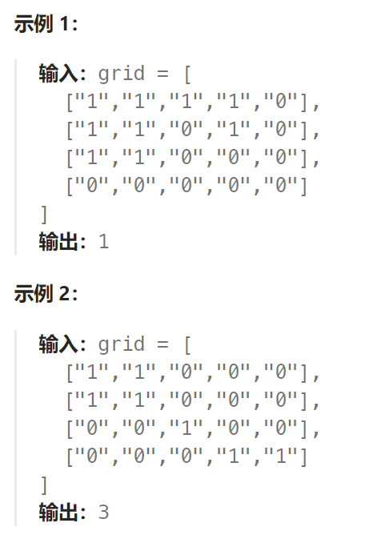

## 题目

给你一个由 `'1'`（陆地）和 `'0'`（水）组成的的二维网格，请你计算网格中岛屿的数量。

岛屿总是被水包围，并且每座岛屿只能由水平方向和/或竖直方向上相邻的陆地连接形成。

此外，你可以假设该网格的四条边均被水包围。



## 题解

岛屿问题，如果用 DFS 解决，思路如下：

每当用遇到一个**没有遍历过的节点陆地**，计数器就加一，然后把该节点陆地所能遍历到的陆地都标记上。在遇到**标记过的陆地节点**和**海洋节点**的时候直接跳过。 这样计数器就是最终岛屿的数量。

```go
func numIslands(grid [][]byte) int {
    rowMax := len(grid)
    colMax := len(grid[0])
    isLand := 0
    var dfs func(int, int) 
    dfs = func(row, col int) {
        if row < 0 || row >= rowMax || col < 0 || col >= colMax {  // 越界访问
            return
        }
        if grid[row][col] == '*' {   // 碰到已经访问过得陆地节点
            return
        }
        if grid[row][col] == '0' {   // 碰到海洋节点
            return
        }
        grid[row][col] = '*'   // 记录该陆地节点已经走过了
        // 负责向上下左右走，把该岛屿的其他位置也标记为 '*'
        dfs(row-1, col)
        dfs(row+1, col)
        dfs(row, col-1)
        dfs(row, col+1)
    } 
    for row := 0; row < rowMax; row++ {
        for col := 0; col < colMax; col++ {
            if grid[row][col] == '1' {   // 碰到没遇到过的陆地节点，岛屿数量 +1
                isLand++
                dfs(row, col)   // 未访问过的陆地节点才会调用 dfs 进行染色
            }
        }
    }
    return isLand
}
```

