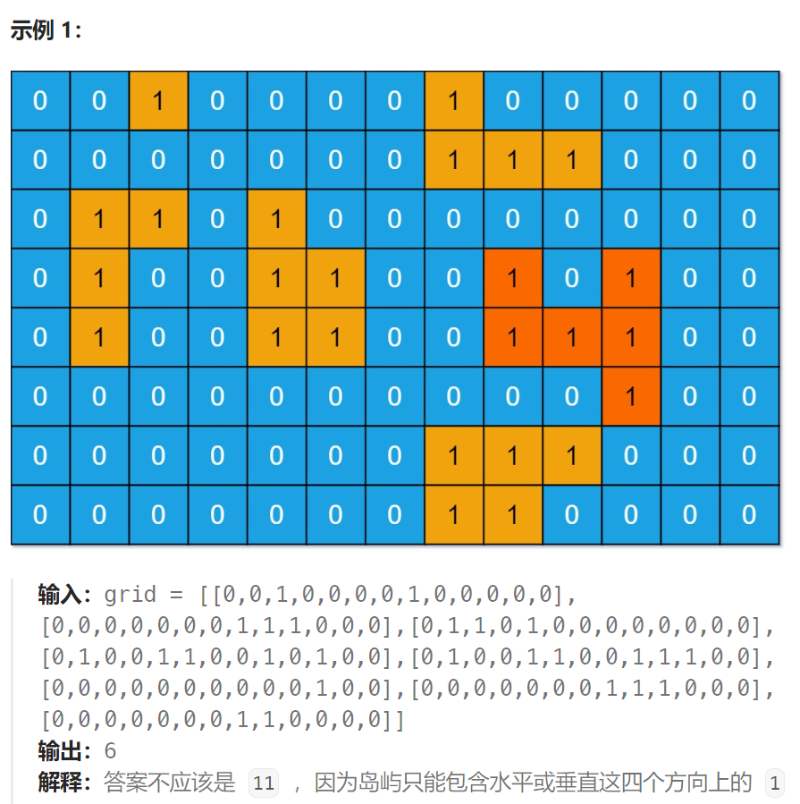

## 题目

给你一个大小为 `m x n` 的二进制矩阵 `grid` 。

**岛屿** 是由一些相邻的 `1` (代表土地) 构成的组合，这里的「相邻」要求两个 `1` 必须在 **水平或者竖直的四个方向上** 相邻。你可以假设 `grid` 的四个边缘都被 `0`（代表水）包围着。

岛屿的面积是岛上值为 `1` 的单元格的数目。

计算并返回 `grid` 中最大的岛屿面积。如果没有岛屿，则返回面积为 `0` 。



## 题解

### 方法一：深搜

```go
func maxAreaOfIsland(grid [][]int) int {
    rowMax := len(grid)
    colMax := len(grid[0])

    curS := 0   // 当前岛屿的面积
    MaxS := 0   // 最大岛屿的面积

    var dfs func(int, int)
    dfs = func(row, col int) {
        if row < 0 || row >= rowMax || col < 0 || col >= colMax {
            return
        }
        if grid[row][col] == 0 || grid[row][col] == 2 {  
            return
        }
        curS++   // 岛屿面积 + 1
        grid[row][col] = 2   // 陆地节点染色

        dfs(row-1, col)
        dfs(row+1, col)
        dfs(row, col-1)
        dfs(row, col+1)
    }

    for row := 0; row < rowMax; row++ {
        for col := 0; col < colMax; col++ {
            if grid[row][col] == 1 {
                dfs(row, col)
                MaxS = getMax(MaxS, curS)  // dfs 结束, 说明一块岛屿已经遍历完毕
                curS = 0   // 回溯，计算下一块岛屿的面积
            }
        }
    }
    return MaxS
}
```

### 方法二：广搜

```go
func maxAreaOfIsland(grid [][]int) int {
    rowMax := len(grid)
    colMax := len(grid[0])
    var dir [4][2]int = [4][2]int{ {-1,0},{1,0},{0,-1},{0,1} }

    curS := 0   // 当前岛屿的面积
    MaxS := 0   // 最大岛屿的面积

    var bfs func(int, int)
    bfs = func(row, col int) {
        q := make([][2]int, 0)
        q = append(q, [2]int{row, col})

        for len(q) > 0 {
            p := q[0]
            q = q[1:]

            x, y := p[0], p[1]
            for i := 0; i < len(dir); i++ {
                newX := x + dir[i][0]
                newY := y + dir[i][1]
                if newX < 0 || newX >= rowMax || newY < 0 || newY >= colMax {
                    continue
                }
                if grid[newX][newY] == 0 || grid[newX][newY] == 2 {
                    continue
                }
                curS++
                q = append(q, [2]int{newX, newY})
                grid[newX][newY] = 2
            }
        }
    }

    for row := 0; row < rowMax; row++ {
        for col := 0; col < colMax; col++ {
            if grid[row][col] == 1 {
                curS++
                grid[row][col] = 2
                bfs(row, col)
                MaxS = getMax(MaxS, curS)
                curS = 0
            }
        }
    }
    return MaxS
}
```

