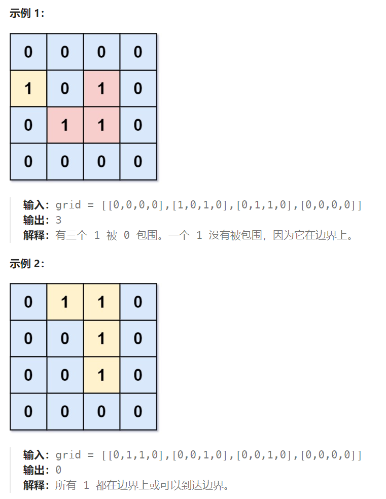

## 题目

给你一个大小为 `m x n` 的二进制矩阵 `grid` ，其中 `0` 表示一个海洋单元格、`1` 表示一个陆地单元格。

一次 **移动** 是指从一个陆地单元格走到另一个相邻（**上、下、左、右**）的陆地单元格或跨过 `grid` 的边界。

返回网格中 **无法** 在任意次数的移动中离开网格边界的陆地单元格的数量。



## 题解

### 方法一：深搜

```go
func numEnclaves(grid [][]int) int {
    rowMax := len(grid)
    colMax := len(grid[0])

    cur := 0  // 当前陆地区域单元格的数量
    curLeave := false  // 当前陆地区域能否离开网格
    res := 0  // 没办法离开网格的陆地单元格数量

    var dfs func(int, int)
    dfs = func(row, col int) {
        if row < 0 || row >= rowMax || col < 0 || col >= colMax {
            curLeave = true   // 当前陆地区域可以离开网格
            return 
        }
        if grid[row][col] == 0 || grid[row][col] == 2 {
            return
        }
        cur++
        grid[row][col] = 2

        dfs(row-1, col)
        dfs(row+1, col)
        dfs(row, col-1)
        dfs(row, col+1)
    }

    for row := 0; row < rowMax; row++ {
        for col := 0; col < colMax; col++ {
            if grid[row][col] == 1 {
                dfs(row, col)
                if !curLeave {   // 这片陆地区域最终没能离开网格
                    res += cur  
                } else {   // 这片区域最终离开了网格
                    curLeave = false
                }
                cur = 0   // 重新去计算另一篇陆地区域的面积
            }
        }
    }
    return res
}
```

### 方法二：广搜

```go
func numEnclaves(grid [][]int) int {
    rowMax := len(grid)
    colMax := len(grid[0])
    var dir [4][2]int = [4][2]int{ {-1,0},{1,0},{0,-1},{0,1} }

    cur := 0  // 当前陆地区域单元格的数量
    curLeave := false  // 当前陆地区域能否离开网格
    res := 0  // 没办法离开网格的陆地单元格数量

    var bfs func(int, int)
    bfs = func(row, col int) {
        q := make([][2]int, 0)
        q = append(q, [2]int{row, col})

        for len(q) > 0 {
            p := q[0]
            q = q[1:]

            x, y := p[0], p[1]
            for i := 0; i < len(dir); i++ {
                newX := x + dir[i][0]
                newY := y + dir[i][1]
                if newX < 0 || newX >= rowMax || newY < 0 || newY >= colMax {
                    curLeave = true
                    continue
                }
                if grid[newX][newY] == 0 || grid[newX][newY] == 2 {
                    continue
                }
                cur++
                q = append(q, [2]int{newX, newY})
                grid[newX][newY] = 2
            }
        }
    }

    for row := 0; row < rowMax; row++ {
        for col := 0; col < colMax; col++ {
            if grid[row][col] == 1 {
                cur++
                grid[row][col] = 2
                bfs(row, col)
                if !curLeave {   // 这片陆地区域最终没能离开网格，需要 + 这块陆地区域的面积
                    res += cur  
                } else {   // 这片区域最终离开了网格
                    curLeave = false
                }
                cur = 0   // 重新去计算另一篇陆地区域的面积
            }
        }
    }
    return res
}
```

### 方法三：广搜 + 自主选择广搜的起点(深搜同理)

下面介绍另外一种方法。因为本题要求找到不靠边的陆地面积，那么我们只要**从矩阵外围开始找**到陆地然后 通过 dfs或者bfs 将外围靠陆地且相邻的陆地都变成已读，然后再去重新遍历地图的时候，统计此时还剩下的陆地就可以了。

如图，在遍历地图周围四个边，靠地图四边的陆地，都为绿色，


这这些绿色的陆地都标记为已读之后，剩余的就是无法离开矩阵的陆地：


```go
func numEnclaves(grid [][]int) int {
    rowMax := len(grid)
    colMax := len(grid[0])
    var dir [4][2]int = [4][2]int{ {-1,0},{1,0},{0,-1},{0,1} }

    res := 0  // 没办法离开网格的陆地单元格数量

    var bfs func(int, int)
    bfs = func(row, col int) {   // bfs 算法只负责将相邻的陆地单元格染色
        q := make([][2]int, 0)
        q = append(q, [2]int{row, col})

        for len(q) > 0 {
            p := q[0]
            q = q[1:]

            x, y := p[0], p[1]
            for i := 0; i < len(dir); i++ {
                newX := x + dir[i][0]
                newY := y + dir[i][1]
                if newX < 0 || newX >= rowMax || newY < 0 || newY >= colMax {
                    continue
                }
                if grid[newX][newY] == 0 || grid[newX][newY] == 2 {
                    continue
                }
                q = append(q, [2]int{newX, newY})
                grid[newX][newY] = 2
            }
        }
    }
    // 1. 起点选择在网格最左/右侧一列
    for row := 0; row < rowMax; row++ {
        if grid[row][0] == 1 {
            grid[row][0] = 2
            bfs(row, 0)
        }  
        if grid[row][colMax-1] == 1 {
            grid[row][colMax-1] = 2
            bfs(row, colMax-1)
        }  
    }
    // 2. 起点选择在网格最上/下方一行
    for col := 0; col < colMax; col++ {
        if grid[0][col] == 1 {
            grid[0][col] = 2
            bfs(0, col)
        }  
        if grid[rowMax-1][col] == 1 {
            grid[rowMax-1][col] = 2
            bfs(rowMax-1, col)
        }  
    }
    // 3. 再次遍历网格，剩余未被染色的 1 即是无法离开网格的陆地
    for row := 0; row < rowMax; row++ {
        for col := 0; col < colMax; col++ {
            if grid[row][col] == 1 {
                res++
            }
        }
    }
    return res
}
```

