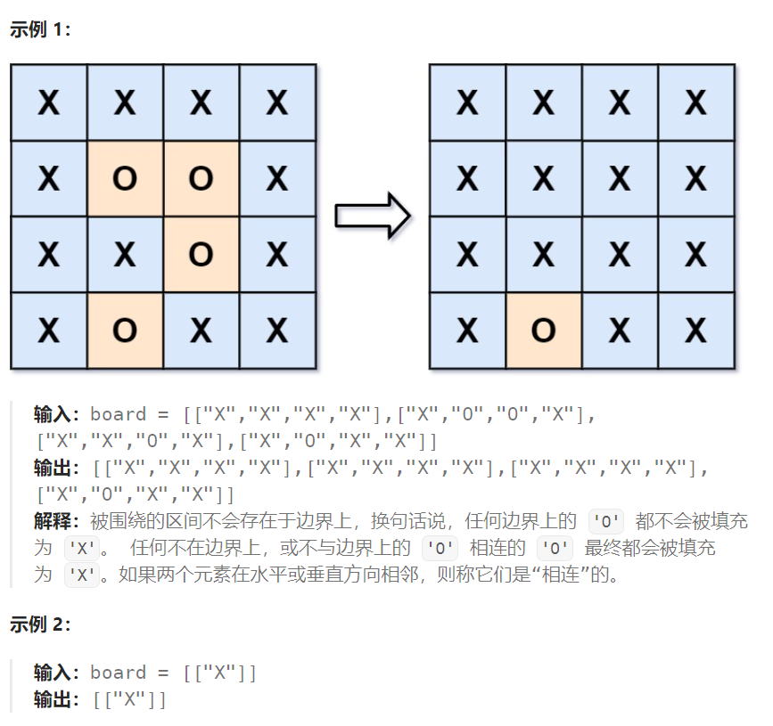

## 题目

给你一个 `m x n` 的矩阵 `board` ，由若干字符 `'X'` 和 `'O'` ，找到所有被 `'X'` 围绕的区域，并将这些区域里所有的 `'O'` 用 `'X'` 填充。



## 题解

```go
func solve(board [][]byte)  {
    rowMax := len(board)
    colMax := len(board[0])

    visitMap := make(map[[2]int]bool)  // 标记某位置是否已经被访问

    var dfs func(int, int)
    dfs = func(row, col int) {   // dfs 只负责将所有相邻 'O' 区域的访问历史记录在案
        if row < 0 || row >= rowMax || col < 0 || col >= colMax {
            return
        }
        if board[row][col] == 'X' || visitMap[[2]int{row, col}] {
            return
        }
        visitMap[[2]int{row, col}] = true

        dfs(row-1, col)
        dfs(row+1, col)
        dfs(row, col-1)
        dfs(row, col+1)
    }
    // 1.选择最左/右侧一列作为 dfs 起点
    for row := 0; row < rowMax; row++ {
        if !visitMap[[2]int{row, 0}] && board[row][0] == 'O' {
            dfs(row, 0)
        } 
        if !visitMap[[2]int{row, colMax-1}] && board[row][colMax-1] == 'O' {
            dfs(row, colMax-1)
        }  
    }
    // 2.选择最上/下方一行作为 dfs 起点
    for col := 0; col < colMax; col++ {
        if !visitMap[[2]int{0, col}] && board[0][col] == 'O' {
            dfs(0, col)
        }  
        if !visitMap[[2]int{rowMax-1, col}] && board[rowMax-1][col] == 'O' {
            dfs(rowMax-1, col)
        }  
    }
    // 3. 再次遍历矩阵，未被访问过的 'O' 就需要用 'x' 填充
    for row := 0; row < rowMax; row++ {
        for col := 0; col < colMax; col++ {
            if !visitMap[[2]int{row, col}] && board[row][col] == 'O' {
                board[row][col] = 'X'
            }
        }
    }
}
```

