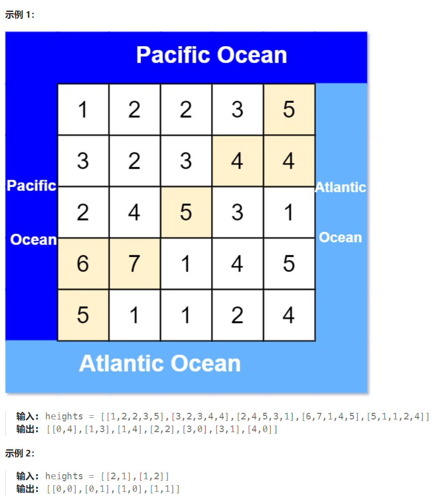

## 题目

有一个 `m × n` 的矩形岛屿，与 **太平洋** 和 **大西洋** 相邻。 **“太平洋”** 处于大陆的左边界和上边界，而 **“大西洋”** 处于大陆的右边界和下边界。

这个岛被分割成一个由若干方形单元格组成的网格。给定一个 `m x n` 的整数矩阵 `heights` ， `heights[r][c]` 表示坐标 `(r, c)` 上单元格 **高于海平面的高度** 。

岛上雨水较多，如果相邻单元格的高度 **小于或等于** 当前单元格的高度，雨水可以直接向北、南、东、西流向相邻单元格。水可以从海洋附近的任何单元格流入海洋。

返回网格坐标 `result` 的 **2D 列表** ，其中 `result[i] = [ri, ci]` 表示雨水从单元格 `(ri, ci)` 流动 **既可流向太平洋也可流向大西洋** 。



## 题解

最简单的思路：遍历每一个点，采用 bfs 或者 dfs 看其能否同时到达太平洋和大西洋，但这明显耗时太长。

可以反过来想，从太平洋边上的节点 **逆流而上**，将**遍历过的节点都标记**上（先找到能够流到太平洋的）。 从大西洋的边上节点 **逆流而上**，将**遍历过的节点也标记**上（再找到能够流向大西洋的）。 然后**两方都标记过的节点就是既可以流太平洋也可以流大西洋的节点**。

```go
func pacificAtlantic(heights [][]int) [][]int {
    rowMax := len(heights)
    colMax := len(heights[0])
    var dir [4][2]int = [4][2]int{ {-1,0},{1,0},{0,-1},{0,1} }
    res := make([][]int, 0)   // 存储结果坐标
    visitPa := make(map[[2]int]bool)  // 能够到达太平洋的所有节点(逆流方式)
    visitAt := make(map[[2]int]bool)  // 能够到达大西洋的所有节点(逆流方式)
    var bfs func(int, int, map[[2]int]bool)
    bfs = func(row, col int, visit map[[2]int]bool) {
        q := make([][2]int, 0)
        q = append(q, [2]int{row, col})
        for len(q) > 0 {
            p := q[0]
            q = q[1:]
            x, y := p[0], p[1]
            for i := 0; i < len(dir); i++ {
                newX := x + dir[i][0]
                newY := y + dir[i][1]
                if newX < 0 || newX >= rowMax || newY < 0 || newY >= colMax {  // 越界
                    continue
                }
                newP := [2]int{newX, newY}
                if visit[newP] {   // 已经访问过的节点不能重复访问
                    continue
                }
                if heights[x][y] <= heights[newX][newY] {  // 能够实现海水逆流
                    q = append(q, newP)
                    visit[newP] = true
                }
            }
        }
    }
    // 1.最上一行太平洋进行逆流; 最后一行，大西洋逆流
    for col := 0; col < colMax; col++ {
        p1 := [2]int{0, col}
        if !visitPa[p1] {
            visitPa[p1] = true
            bfs(0, col, visitPa)
        }
        p2 := [2]int{rowMax-1, col}
        if !visitAt[p2] {
            visitAt[p2] = true
            bfs(rowMax-1, col, visitAt)
        }
    }
    // 2. 最左列太平洋逆流; 最右列大西洋逆流
    for row := 0; row < rowMax; row++ {
        p1 := [2]int{row, 0}
        if !visitPa[p1] {
            visitPa[p1] = true
            bfs(row, 0, visitPa)
        }
        p2 := [2]int{row, colMax-1}
        if !visitAt[p2] {
            visitAt[p2] = true
            bfs(row, colMax-1, visitAt)
        }
    }
    for row := 0; row < rowMax; row++ {
        for col := 0; col < colMax; col++ {
            p := [2]int{row, col}
            if visitAt[p] && visitPa[p] {   // 该位置能够同时流入太平洋和大西洋
                res = append(res, []int{row, col})
            }
        }
    }
    return res
}
```

