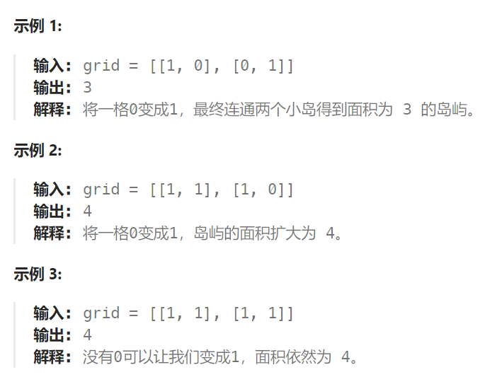

## 题目

给你一个大小为 `n x n` 二进制矩阵 `grid` 。**最多** 只能将一格 `0` 变成 `1` 。

返回执行此操作后，`grid` 中最大的岛屿面积是多少？

**岛屿** 由一组上、下、左、右四个方向相连的 `1` 形成。



## 题解

本题的一个暴力想法，应该是遍历地图尝试 将每一个 0 改成1，然后去搜索地图中的最大的岛屿面积。

但是每次 dfs 或者 bfs ，时间复杂度都是 O(N^2)。每次尝试0换1，重新开始，复杂度是O(n^2)。总的时间复杂度就是 O(N^4)

#### 优化思路

第一步：只进行一次 bfs 或者 dfs，将每个岛屿的面积计算出来，并做编号记录。可以使用map记录，key为岛屿编号，value为岛屿面积

第二步：再遍历地图，遍历0的方格（因为要将0变成1），并统计该1（由0变成的1）周边岛屿面积，将其相邻面积相加在一起。当遍历完所有 0 之后，就可以得出 选一个0变成1 之后的最大面积。

拿如下地图的岛屿情况来举例： （1为陆地）


第一步，则遍历题目，并将岛屿到编号和面积上的统计，过程如图所示：


**n \* n这个方格地图中，每个节点我们就遍历一次，并不会重复遍历**。

第二步过程如图所示：


也就是遍历每一个0的方格，并统计其相邻岛屿面积，最后取一个最大值。

所以整个解法的时间复杂度，为 n * n + n * n 也就是 n^2。

```go
func largestIsland(grid [][]int) int {
    rowMax := len(grid)
    colMax := len(grid[0])
    var dir [4][2]int = [4][2]int{ {-1,0},{1,0},{0,-1},{0,1} }
    
    islands := make(map[int]int)  // 记录每个编号岛屿的面积
    
    curS := 0   // 当前岛屿面积
    var bfs func(int, int, int)
    bfs = func(row, col int, number int) {
        q := make([][2]int, 0)
        q = append(q, [2]int{row, col})
        for len(q) > 0 {
            p := q[0]
            q = q[1:]
            x, y := p[0], p[1]
            for i := 0; i < len(dir); i++ {
                newX := x + dir[i][0]
                newY := y + dir[i][1]
                if newX < 0 || newX >= rowMax || newY < 0 || newY >= colMax {
                    continue
                }
                if grid[newX][newY] == number {  // 岛屿已经被访问过了(数值 == 当前岛屿编号)
                    continue
                }
                if grid[newX][newY] == 0 {   // 到达岛屿的边界
                    continue
                }
                q = append(q, [2]int{newX, newY})
                grid[newX][newY] = number  // 标记已读,设置为岛屿编号
                curS++
            }
        }
    } 
    // 1. 第一次遍历，获取每个岛屿的面积
    number := 2  // 岛屿的编号
    for row := 0; row < rowMax; row++ {
        for col := 0; col < colMax; col++ {
            if grid[row][col] == 1 {   // 当前是未访问过的岛屿
                grid[row][col] = number  // 标记已读,设置为岛屿编号
                curS++
                bfs(row, col, number)
                // 一座岛屿染色完毕, 记录该岛屿的面积
                if curS == rowMax * colMax {   // 全部都是1
                    return curS
                }
                islands[number] = curS   
                // 准备染色记录下一岛屿
                number++
                curS = 0
            }
        }
    }
    var islandNo func(int, int) int   // 获取指定坐标岛屿的编号
    islandNo = func(row, col int) int {
        if row < 0 || row >= rowMax || col < 0 || col >= colMax {
            return 0
        }
        return grid[row][col]
    }
    // 2. 第二次遍历，寻找所有的0, 将附近岛屿面积之和最大的0变成1
    maxS := 0   // 最大面积
    for row := 0; row < rowMax; row++ {
        for col := 0; col < colMax; col++ {
            if grid[row][col] == 0 {
                around := make(map[int]bool)   // 记录周围出现的岛屿
            	s := 1   // 面积
                around[islandNo(row-1, col)] = true
                around[islandNo(row+1, col)] = true
                around[islandNo(row, col-1)] = true
                around[islandNo(row, col+1)] = true
                for no, _ := range around {
                    s += islands[no]
                }
                if s > maxS {
                    maxS = s
                }
            }
        }
    }
    return maxS
}
```

