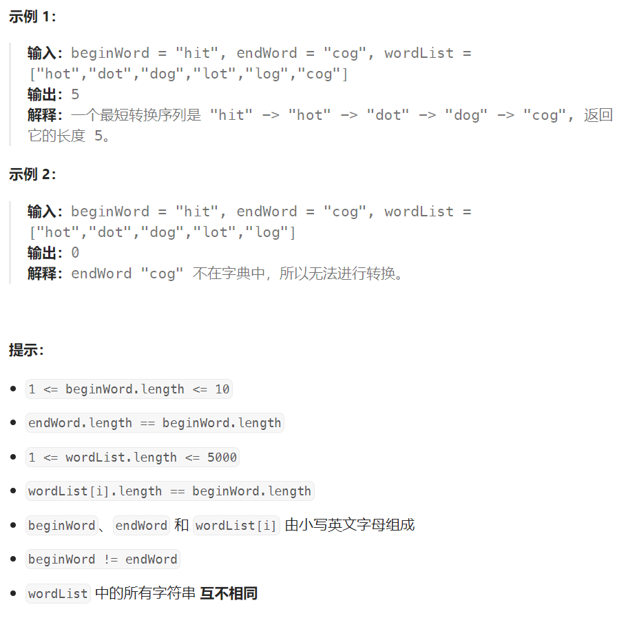

## 题目

字典 `wordList` 中从单词 `beginWord` 和 `endWord` 的 **转换序列** 是一个按下述规格形成的序列 `beginWord -> s1 -> s2 -> ... -> sk`：

- 每一对相邻的单词只差一个字母。
-  对于 `1 <= i <= k` 时，每个 `si` 都在 `wordList` 中。注意， `beginWord` 不需要在 `wordList` 中。
- `sk == endWord`

给你两个单词 `beginWord` 和 `endWord` 和一个字典 `wordList` ，返回 *从 `beginWord` 到 `endWord` 的 **最短转换序列** 中的 **单词数目*** 。如果不存在这样的转换序列，返回 `0` 。



## 题解

### 方法一：广搜

采用 BFS 算法，保存每个字符串在转换路径上的最小序号（最小 BFS 层数），最后返回 endWord 的最小序号，即是最短转换路径的长度。

```go
func ladderLength(beginWord string, endWord string, wordList []string) int {
    endExist := false
    for i := 0; i < len(wordList); i++ {
        if wordList[i] == endWord {
            endExist = true
        }
    }
    if !endExist {  // endWord 不存在
        return 0
    }
    layerMap := make(map[string]int)  // 标注一个字符串所在的最小层数

    var bfs func(string)
    bfs = func(curS string) {
        q := make([]string, 0)  // 存放可以作为下一转换序列的字符串
        q = append(q, curS)
        for len(q) > 0 {
            p := q[0]
            q = q[1:]
            if p == endWord {   // 不需要再往下转换
                continue
            }
            for i := 0; i < len(wordList); i++ {
                word := wordList[i]
                if judge(p, word) {   // p 与 curS 只相差一个字符
                    q = append(q, word)
                    wordList[i] = ""   // 这些字符串需要设置为已读
                    if _,ok := layerMap[word]; !ok {   // 仅当字符串第一次出现时进行记录, 此时就是从该字符串在转换路径上的最小层数
                        layerMap[word] = layerMap[p] + 1
                    } 
                }
            }        
        }
    }
    for i := 0; i < len(wordList); i++ {
        if wordList[i] == beginWord {
            wordList[i] = ""
        }
    }
    layerMap[beginWord] = 1   // beginWord 在最短转换路径中最小肯定是位于第一层
    bfs(beginWord)

    if layer, ok := layerMap[endWord]; !ok {
        return 0
    } else {
        return layer
    }
}
// 判断两个字符是否只有 1 位不同
func judge(s1, s2 string) bool {
    if len(s1) != len(s2) {
        return false
    }
    i1, i2 := 0, 0
    diff := 0
    for i := 0; i < len(s1); i++ {
        if s1[i1] != s2[i2] {
            if diff > 0 {
                return false
            }
            diff++
        }
        i1++
        i2++
    }
    return diff == 1
}
```

