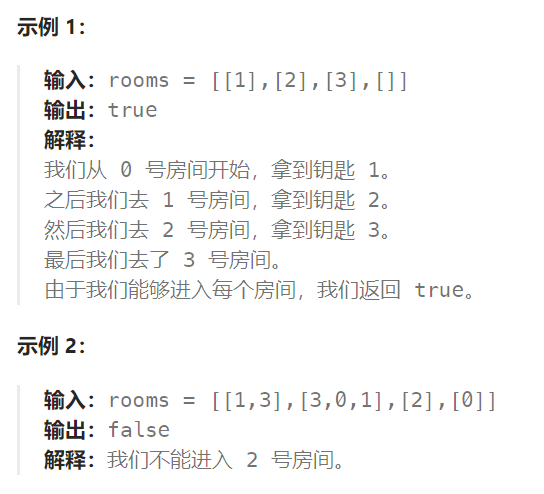

## 题目

有 `n` 个房间，房间按从 `0` 到 `n - 1` 编号。最初，除 `0` 号房间外的其余所有房间都被锁住。你的目标是进入所有的房间。然而，你不能在没有获得钥匙的时候进入锁住的房间。

当你进入一个房间，你可能会在里面找到一套不同的钥匙，每把钥匙上都有对应的房间号，即表示钥匙可以打开的房间。你可以拿上所有钥匙去解锁其他房间。

给你一个数组 `rooms` 其中 `rooms[i]` 是你进入 `i` 号房间可以获得的钥匙集合。如果能进入 **所有** 房间返回 `true`，否则返回 `false`。



## 题解

```go
func canVisitAllRooms(rooms [][]int) bool {
    visitMap := make(map[int]bool)   // 记录已经过的房间

    var bfs func(int)
    bfs = func(roomIndex int) {
        q := make([][]int, 0)
        q = append(q, rooms[roomIndex])  // 获取从该房间拿到的一系列钥匙
        for len(q) > 0 {
            p := q[0]
            q = q[1:]
            for i := 0; i < len(p); i++ {   // 挨个查看这些钥匙对应的房间
                room := p[i] 
                if !visitMap[room] {   // 该房间未进入过, 则进入并取出其中的钥匙
                    visitMap[room] = true
                    q = append(q, rooms[room])
                }
            }
        }
    }
    visitMap[0] = true
    bfs(0)
    for i := 0; i < len(rooms); i++ {
        if !visitMap[i] {   // 有一个节点未访问，就是 false
            return false
        }
    }
    return true
}
```

