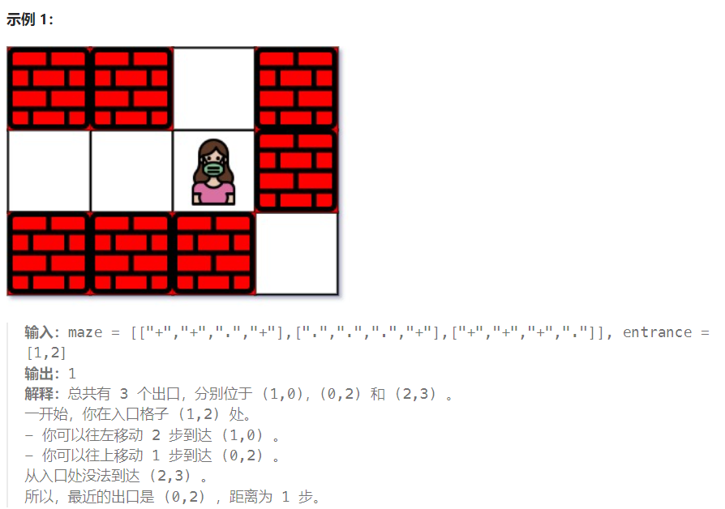
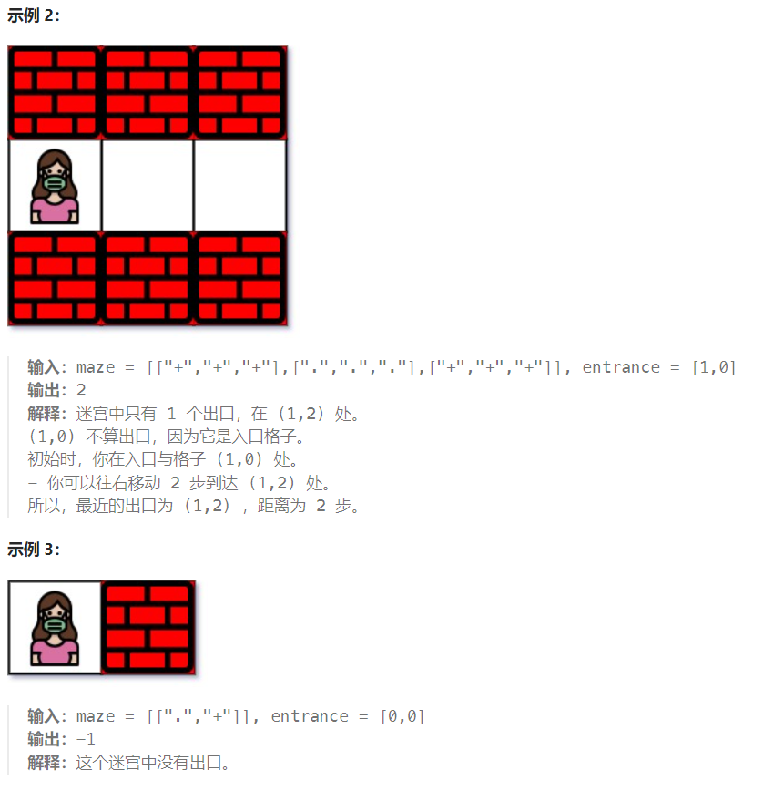

## 题目

给你一个 `m x n` 的迷宫矩阵 `maze` （**下标从 0 开始**），矩阵中有空格子（用 `'.'` 表示）和墙（用 `'+'` 表示）。同时给你迷宫的入口 `entrance` ，用 `entrance = [entrancerow, entrancecol]` 表示你一开始所在格子的行和列。

每一步操作，你可以往 **上**，**下**，**左** 或者 **右** 移动一个格子。你不能进入墙所在的格子，你也不能离开迷宫。你的目标是找到离 `entrance` **最近** 的出口。**出口** 的含义是 `maze` **边界** 上的 **空格子**。`entrance` 格子 **不算** 出口。

请你返回从 `entrance` 到最近出口的最短路径的 **步数** ，如果不存在这样的路径，请你返回 `-1` 。





## 题解

```go
func nearestExit(maze [][]byte, entrance []int) int {
    rowMax := len(maze)
    colMax := len(maze[0])
    var dirs [4][2]int = [4][2]int{ {-1,0}, {1,0}, {0,-1}, {0,1} } 
    minStep := 0
    var isEdge  func (int, int) bool 
    isEdge = func(row, col int) bool {  // 判断某个空格子是否是边界的空格子
        if row == 0 || row == rowMax -1 || col == 0 || col == colMax - 1 {
            return true
        } else {
            return false
        }
    }
    var bfs func(int, int)
    bfs = func(row, col int) {
        q := make([][2]int, 0)
        q = append(q, [2]int{row, col})
        for len(q) > 0 {
            curLayer := len(q)
            move := false  // 本层 bfs 是否移动过
            for j := 0; j < curLayer; j++ {   // 当一层的节点全部结束遍历时，层数(步数)++
                p := q[0]
                q = q[1:]
                x, y := p[0], p[1]
                for i := 0; i < len(dirs); i++ {
                    newX := x + dirs[i][0]
                    newY := y + dirs[i][1]
                    if newX < 0 || newX >= rowMax || newY < 0 || newY >= colMax {
                        continue
                    }
                    if maze[newX][newY] == '+' || maze[newX][newY] == '*' {  // 墙或者已经访问的空格子
                        continue
                    }
                    if isEdge(newX, newY) {  // 这个空格子是边界, 结束 bfs
                        return
                    }
                    maze[newX][newY] = '*'  // 不是边界空格子，还需要继续向外移动
                    q = append(q, [2]int{newX, newY})
                    move = true
                }
            }
            if !move {  // 本轮 bfs 根本没有移动，说明不存在终点
                minStep = -1
                return
            }
            minStep++  // 步数 +1
        }
    }
    maze[entrance[0]][entrance[1]] = '*'  // 标记为已读
    minStep++
    bfs(entrance[0], entrance[1])

    return minStep
}
```

