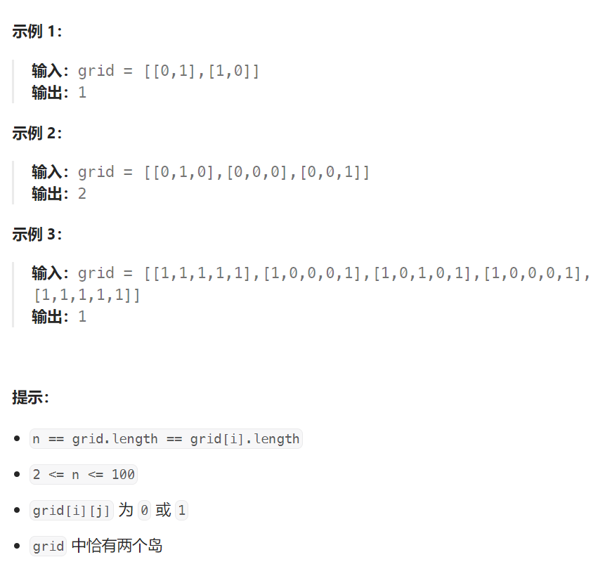

## 题目

给你一个大小为 `n x n` 的二元矩阵 `grid` ，其中 `1` 表示陆地，`0` 表示水域。

**岛** 是由四面相连的 `1` 形成的一个最大组，即不会与非组内的任何其他 `1` 相连。`grid` 中 **恰好存在两座岛** 。

你可以将任意数量的 `0` 变为 `1` ，以使两座岛连接起来，变成 **一座岛** 。

返回必须翻转的 `0` 的最小数目。



## 题解

需要进行两步遍历：

第一次遍历，将第一个岛屿进行染色（dfs 或者 bfs），同时找到包围第一个岛屿的海洋格子，将其染色并放入队列中。

第二次遍历，从上面的海洋格子出发，采用 bfs 扩展，直到抵达第二个岛屿，此时 bfs 扩展的次数就是两个岛之间桥的最短长度。


```go
func shortestBridge(grid [][]int) int {
    rowMax := len(grid)
    colMax := len(grid[0])
    var dirs [4][2]int = [4][2]int{ {-1,0}, {1,0}, {0,-1}, {0,1} } 
    oceans := make([][2]int, 0)   // 存储第一轮结束后被染色的海洋格子

    var dfs func(int, int)
    dfs = func(row, col int) {
        if row < 0 || row >= rowMax || col < 0 || col >= colMax {
            return
        }
        if grid[row][col] == 2 {  // 已经访问的陆地格子
            return
        }
        if grid[row][col] == 0 {  // 海洋格子，保存并染色
            oceans = append(oceans, [2]int{row, col})
            grid[row][col] = 2
            return
        }
        grid[row][col] = 2  // 染色
        dfs(row-1, col)
        dfs(row+1, col)
        dfs(row, col-1)
        dfs(row, col+1)
    }
    layer := 1   // 所需的 bfs 层数
    var bfs func( )
    bfs = func() {
        for len(oceans) > 0 {   // oceans[] 就是 bfs 中的保存队列
            curLayer := len(oceans)  // 本层海洋格子的总数
            for i := 0; i < curLayer; i++ {
                p := oceans[0]
                oceans = oceans[1:]
                x, y := p[0], p[1]
                for j := 0; j < len(dirs); j++ {
                    newX := x + dirs[j][0]
                    newY := y + dirs[j][1]
                    if newX < 0 || newX >= rowMax || newY < 0 || newY >= colMax {
                        continue
                    }
                    if grid[newX][newY] == 2 {  // 已经访问过的格子
                        continue
                    }
                    if grid[newX][newY] == 1 {  // 遇见新的陆地格子, 结束 bfs 扩展
                        return
                    }
                    // 新的海洋格子, 染色并放入队列
                    grid[newX][newY] = 2
                    oceans = append(oceans, [2]int{newX, newY})
                }
            }
            layer++  // 本轮未抵达另一个陆地，还需进行下一次 bfs
        }
    }
    // 1.先将第一个岛屿染色为 2
    // 同时将该岛屿周围的海洋格子放入 bfs 队列
    for row := 0; row < rowMax; row++ {
        for col := 0; col < colMax; col++ {
            if grid[row][col] == 1 {  
                dfs(row, col)
    // 2.将保存的海洋格子采用 bfs 继续向外扩展，直到到达第二个岛屿
                bfs()             
                return layer
            }
        }
    }
    return -1
}
```

