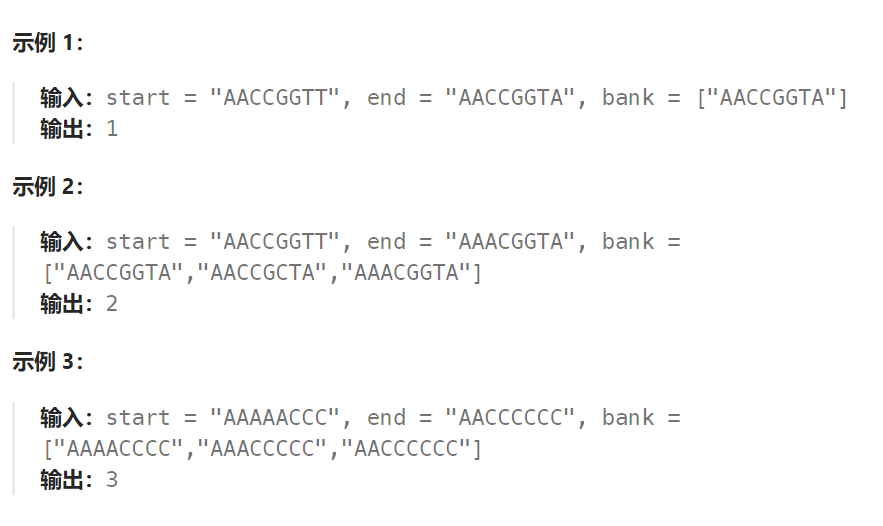

## 题目

基因序列可以表示为一条由 8 个字符组成的字符串，其中每个字符都是 `'A'`、`'C'`、`'G'` 和 `'T'` 之一。

假设我们需要调查从基因序列 `start` 变为 `end` 所发生的基因变化。一次基因变化就意味着这个基因序列中的一个字符发生了变化。

- 例如，`"AACCGGTT" --> "AACCGGTA"` 就是一次基因变化。

另有一个基因库 `bank` 记录了所有有效的基因变化，只有基因库中的基因才是有效的基因序列。（变化后的基因必须位于基因库 `bank` 中）

给你两个基因序列 `start` 和 `end` ，以及一个基因库 `bank` ，请你找出并返回能够使 `start` 变化为 `end` 所需的最少变化次数。如果无法完成此基因变化，返回 `-1` 。

注意：起始基因序列 `start` 默认是有效的，但是它并不一定会出现在基因库中。



## 题解

该题解法与单词接龙一样，使用 bfs 解决即可。

解法唯一的区别： judge 函数发生了变化。

```go
func minMutation(startGene string, endGene string, bank []string) int {
    // 1. 确保 endGene 存在于基因库
    exist := false
    for i := 0; i < len(bank); i++ {
        if bank[i] == endGene {
            exist = true
        }
    }
    if !exist {
        return -1
    }
    if startGene == endGene {
        return 0
    }
    minStep := 0   // 最少变化次数

    var bfs func(string)
    bfs = func(s string) {
        q := make([]string, 0)
        q = append(q, s)
        for len(q) > 0 {
            curLayer := len(q)
            change := false  // 标记本轮是否有变换
            for i := 0; i < curLayer; i++ {
                p := q[0]
                q = q[1:]
                for j := 0; j < len(bank); j++ {
                    if judge(p, bank[j]) {  // 只有一个基因不同
                        if bank[j] == endGene {   // 到达最终基因，结束 bfs
                            return
                        } else {
                            q = append(q, bank[j])
                            bank[j] = ""   // 标记为已读
                            change = true
                        }
                    }
                }
            }
            if !change {
                minStep = -1
                return 
            }

            minStep++  // 当前 bfs 层数无法到达 endGene,还需要再变化
        }
    }
    // 将基因库中的所有 startGene 标记为已读
    for i := 0; i < len(bank); i++ {
        if bank[i] == startGene {
            bank[i] = ""
        }
    }
    minStep++
    bfs(startGene)

    return minStep
}

func judge(s1, s2 string) bool {
    if len(s1) != len(s2) {
        return false
    }
    s1Bytes := []byte(s1)
    for i := 0; i < len(s1Bytes); i++ {  // s1 的每种字符只能是 A C G T 四种之一 
        char := s1Bytes[i]
        for j := 0; j < len("ACGT"); j++ {
            if char != "ACGT"[j] {   // 替换的基因不能与原本的一样
                s1Bytes[i] = "ACGT"[j]
                if string(s1Bytes) == s2 {   // 替换一个基因后相同
                    return true
                } else {   // 不相同，将替换的基因回溯
                    s1Bytes[i] = char   
                }
            }
        }
    }
    return false
}
```

