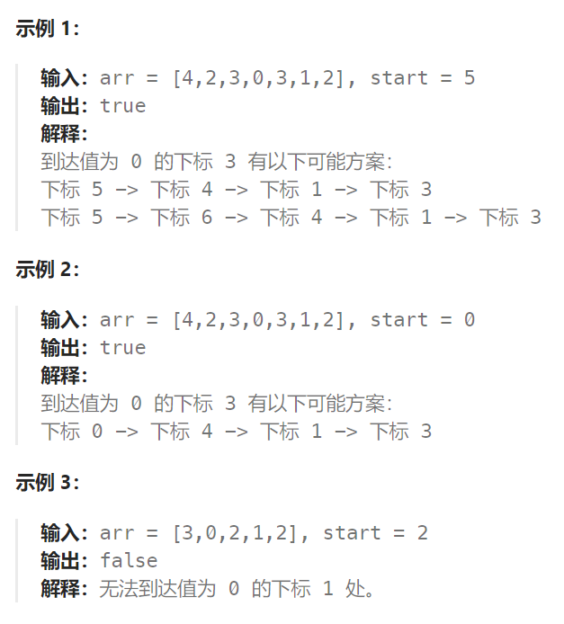

## 题目

这里有一个非负整数数组 `arr`，你最开始位于该数组的起始下标 `start` 处。当你位于下标 `i` 处时，你可以跳到 `i + arr[i]` 或者 `i - arr[i]`。

请你判断自己是否能够跳到对应元素值为 0 的 **任一** 下标处。

注意，不管是什么情况下，你都无法跳到数组之外。



## 题解

```go
func canReach(arr []int, start int) bool {
    if len(arr) == 0 {
        return false
    }
    if arr[start] == 0 {
        return true
    }
    n := len(arr)
    visit := make([]bool, n)  // 记录节点是否被访问过 
    var dirs [2]int = [2]int{-1, 1}
    
    var bfs func(int) bool
    bfs = func(i int) bool {
        q := make([]int, 0)
        q = append(q, i)

        for len(q) > 0 {
            p := q[0]
            q = q[1:]

            for j := 0; j < len(dirs); j++ {  // 向左或向右移动
                next := p + dirs[j]*arr[p]  
                if next < 0 || next >= n {  // 越界
                    continue
                }
                if visit[next] {   // 已经访问过的节点
                    continue
                }
                if arr[next] == 0 {   // 访问到某一个0，成功，结束 bfs
                    return true
                }
                visit[next] = true
                q = append(q, next)
            }
        }
        return false  // bfs 结束了，没能到达任何一个0
    }
    visit[start] = true
    return bfs(start)
}
```

