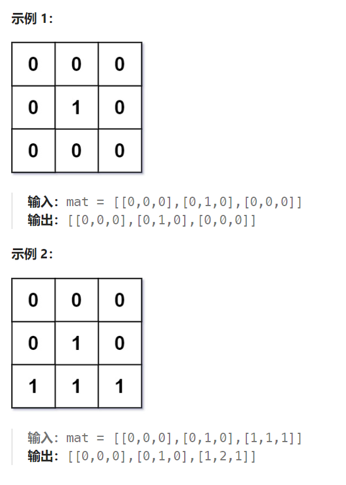

## 题目

给定一个由 `0` 和 `1` 组成的矩阵 `mat` ，请输出一个大小相同的矩阵，其中每一个格子是 `mat` 中对应位置元素到最近的 `0` 的距离。

两个相邻元素间的距离为 `1` 。



## 题解

### 方法一：dfs

从每个 1 出发，采用 dfs 即可得到每个 1 到 0 的最近距离，但这样做时间复杂度是 O(N^4)

### 方法二：bfs

另一种更巧妙的方式是采用 bfs，但是 bfs 的起点不是单独一个坐标（从每个1开始或者从每个0开始），而是**从矩阵中所有的 0 开始**。

举一个例子，在这个例子中，有两个 0 ：

```
_ _ _ _
_ 0 _ _
_ _ 0 _
_ _ _ _
```

我们会把这两个 0 的位置都加入 bfs 初始队列中，随后我们进行广度优先搜索，找到所有距离为 1 的 1 ：

```
_ 1 _ _
1 0 1 _
_ 1 0 1
_ _ 1 _
```

接着重复步骤，直到搜索完成：

```
_ 1 _ _         2 1 2 _         2 1 2 3
1 0 1 _   ==>   1 0 1 2   ==>   1 0 1 2
_ 1 0 1         2 1 0 1         2 1 0 1
_ _ 1 _         _ 2 1 2         3 2 1 2
```

这样做的时间复杂度为：O(N^2) + O(N^2) = O(N^2)

```GO
func updateMatrix(mat [][]int) [][]int {
    rowMax := len(mat)
    colMax := len(mat[0])
    var dirs [4][2]int = [4][2]int{ {-1,0}, {1,0}, {0,-1}, {0,1}}
    res := make([][]int, rowMax)
    for i := range res {
        res[i] = make([]int, colMax)
    }
    
    layer := 0   // 记录当前 bfs 层数
    var bfs func([][2]int)
    bfs = func(q [][2]int) {
        for len(q) > 0 {
            curLayer := len(q)
            for j := 0; j < curLayer; j++ {
                p := q[0]
                q = q[1:]
                x, y := p[0], p[1]
                for i := 0; i < len(dirs); i++ {
                    newX := x + dirs[i][0]
                    newY := y + dirs[i][1]
                    if newX < 0 || newX >= rowMax || newY < 0 || newY >= colMax {
                        continue
                    }
                    if mat[newX][newY] == -1 {  // 已经访问过
                        continue
                    }
                    // 遇到了 1, 该1到0的最近距离 == 0区域到该 1 的距离 == bfs 层数
                    res[newX][newY] = layer
                    mat[newX][newY] = -1
                    q = append(q, [2]int{newX, newY})
                }
            }
            layer++
        }
    }
    // 1.将所有的 0 统一加入到队列中，以此队列开始进行 bfs 向外扩展
    q := make([][2]int, 0)
    for row := 0; row < rowMax; row++ {
        for col := 0; col < colMax; col++ {
            if mat[row][col] == 0 {
                mat[row][col] = -1   // 标记为已访问
                q = append(q, [2]int{row, col})
            }
        }
    }
    // 2.将队列中的 0 视为 bfs 第一层，使用 bfs 算法向外扩展
    layer = 1
    bfs(q)
    return res
}
```

