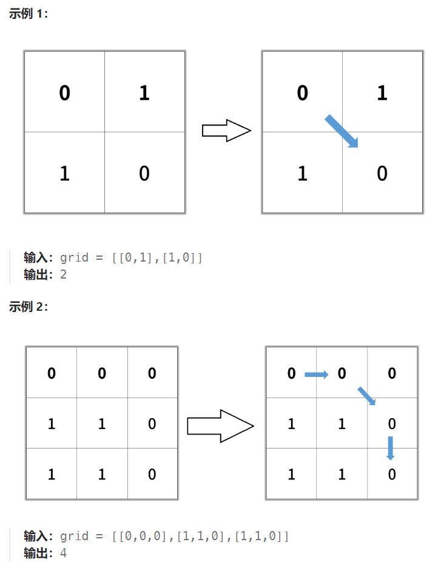

## 题目

给你一个 `n x n` 的二进制矩阵 `grid` 中，返回矩阵中最短 **畅通路径** 的长度。如果不存在这样的路径，返回 `-1` 。

二进制矩阵中的 畅通路径 是一条从 **左上角** 单元格（即，`(0, 0)`）到 右下角 单元格（即，`(n - 1, n - 1)`）的路径，该路径同时满足下述要求：

- 路径途经的所有单元格的值都是 `0` 。
- 路径中所有相邻的单元格应当在 **8 个方向之一** 上连通（即，相邻两单元之间彼此不同且共享一条边或者一个角）。

**畅通路径的长度** 是该路径途经的单元格总数。



## 题解

```go
func shortestPathBinaryMatrix(grid [][]int) int {
    rowMax := len(grid)
    colMax := len(grid[0])
    if grid[0][0] == 1 || grid[rowMax-1][colMax-1] == 1 {  // 起点和终点必须都是0
        return -1
    }
    if rowMax == 1  && colMax == 1 {   // 矩阵只有一个 0
        return 1
    }
    // 8 个方向
    var dirs [8][2]int = [8][2]int{{-1,0},{1,0},{0,-1},{0,1},{-1,-1},{-1,1},{1,-1},{1,1}}  
    count := 0   // 包括起点在内的途径格子数(bfs层数+1)
    var bfs func(int, int)
    bfs = func(row, col int) {
        q := make([][2]int, 0)
        q = append(q, [2]int{row, col})

        for len(q) > 0 {
            curLayer := len(q)
            move := false   // 本轮 bfs 是否移动
            for i := 0; i < curLayer; i++ {
                p := q[0]
                q = q[1:]
                x, y := p[0], p[1]
                for j := 0; j < len(dirs); j++ {
                    newX := x + dirs[j][0]
                    newY := y + dirs[j][1]
                    if newX < 0 || newX >= rowMax || newY < 0 || newY >= colMax {
                        continue
                    }
                    if grid[newX][newY] == 1 || grid[newX][newY] == -1 {
                        continue
                    }
                    if newX == rowMax -1 && newY == colMax - 1 {  // 到达终点
                        return
                    }
                    // 到达了并非终点的 0
                    grid[newX][newY] = -1
                    q = append(q, [2]int{newX, newY})
                    move = true
                }
            }
            if !move {   // 本轮 bfs 无处可走，说明到不了终点
                count = -1
                return
            }
            count++
        }
    }
    grid[0][0] = -1  // 标记已经过
    count = 2
    bfs(0, 0)
    return count
}
```

