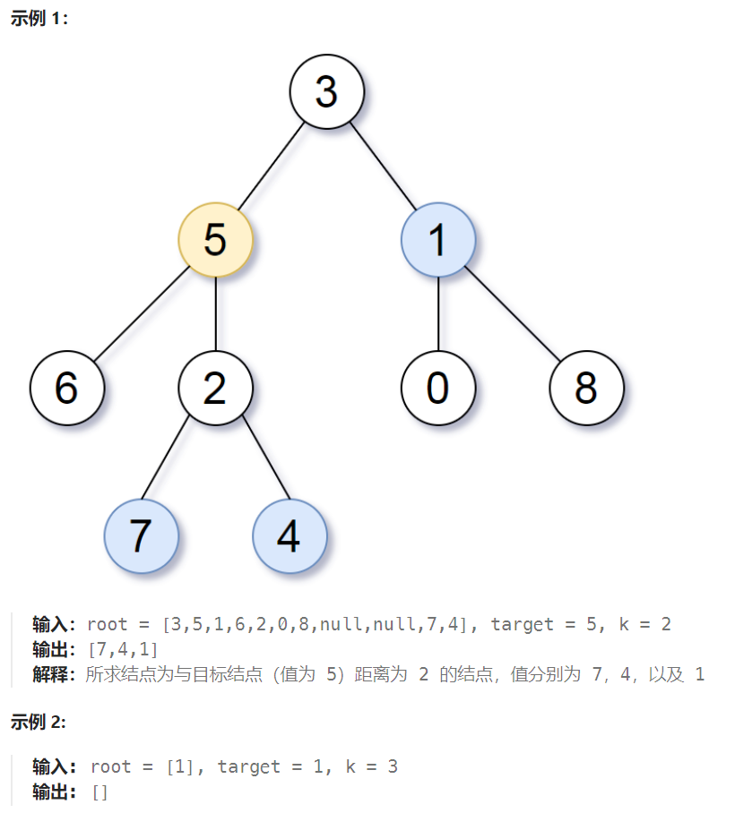

## 题目

给定一个二叉树（具有根结点 `root`）， 一个目标结点 `target` ，和一个整数值 `k` 。

返回到目标结点 `target` 距离为 `k` 的所有结点的值的列表。 答案可以以 **任何顺序** 返回。



## 题解

### 方法一：建图 + BFS

显然，如果题目是以图的形式给出的话，我们可以很容易通过「BFS / 迭代加深」找到距离为 k 的节点集。

而树是一类特殊的图，我们可以通过**将二叉树转换为图的形式**，再进行「BFS / 迭代加深」。

```go
func distanceK(root *TreeNode, target *TreeNode, k int) []int {
    if root == nil || target == nil {  // root 和 target 都不能为空
        return []int{}
    }
    if k == 0 {   // 距离 target 为0的，只有 target 自己
        return []int{target.Val} 
    }
    // g[i]保存着所有与i相连的其他节点(父节点和左右子节点)
    g := make([][]int, 501)   // 条件给出了节点的取值范围 0~500 共501种可能

    var dfs func(*TreeNode, *TreeNode)
    dfs = func(root, parent *TreeNode) {
        if root == nil {
            return
        }
        if parent != nil {
            g[root.Val] = append(g[root.Val], parent.Val)  // 与父节点是相连的
        }
        if root.Left != nil {
            g[root.Val] = append(g[root.Val], root.Left.Val)  // 与左孩子节点是相连的
            dfs(root.Left, root)
        }
        if root.Right != nil {
            g[root.Val] = append(g[root.Val], root.Right.Val)  // 与右孩子节点是相连的
            dfs(root.Right, root)
        }
    }
    // 1.通过 dfs 遍历二叉树，填充 g
    dfs(root, nil) 

    layer := 0   // 当前 bfs 层数
    res := make([]int, 0)  // 结果，距离 target 为 k 的所有节点
    visit := make([]bool, 501)   // 记录节点是否已经访问过

    var bfs func(int)
    bfs = func(index int) {
        q := make([]int, 0)
        q = append(q, index)
        for len(q) > 0 {
            curLayer := len(q)
            for i := 0; i < curLayer; i++ {
                p := q[0]
                q = q[1:]
                for j := 0; j < len(g[p]); j++ {
                    next := g[p][j]   // 与 p 相连的节点 next
                    if visit[next] {  // 节点已经访问过
                        continue
                    }
                    visit[next] = true
                    q = append(q, next)
                }
            }
            if layer == k {   // 当前为第 k 层，q中的节点就是距离 target 为k的所有节点
                res = append(res, q...)
                return
            } else {
                layer++
            } 
        }
    }
    // 2.使用获得的 g 通过 bfs 扩展k步，得到结果
    layer = 1
    visit[target.Val] = true
    bfs(target.Val)

    return res
}
```

### 方法二：哈希表 + DFS

用哈希表实现 子 - 父 关系表，每个节点可以获取自己的父节点，这个过程需要遍历一次二叉树。

第二次遍历，每个节点都有三个方向向外扩展：左孩子节点，右孩子节点，根节点。

```go
func distanceK(root, target *TreeNode, k int) (ans []int) {
    // 从 root 出发 DFS，记录每个结点的父结点
    parents := map[int]*TreeNode{}
    var findParents func(*TreeNode)
    findParents = func(node *TreeNode) {
        if node.Left != nil {
            parents[node.Left.Val] = node
            findParents(node.Left)
        }
        if node.Right != nil {
            parents[node.Right.Val] = node
            findParents(node.Right)
        }
    }
    findParents(root)  // 构建子-父关系表

    // 从 target 出发 DFS，寻找所有深度为 k 的结点
    var findAns func(*TreeNode, *TreeNode, int)
    findAns = func(node, from *TreeNode, depth int) {
        if node == nil {
            return
        }
        if depth == k { // 将所有深度为 k 的结点的值计入结果
            ans = append(ans, node.Val)
            return
        }
        if node.Left != from {  
            findAns(node.Left, node, depth+1)
        }
        if node.Right != from {
            findAns(node.Right, node, depth+1)
        }
        if parents[node.Val] != from {
            findAns(parents[node.Val], node, depth+1)
        }
    }
    findAns(target, nil, 0)
    return
}
```


