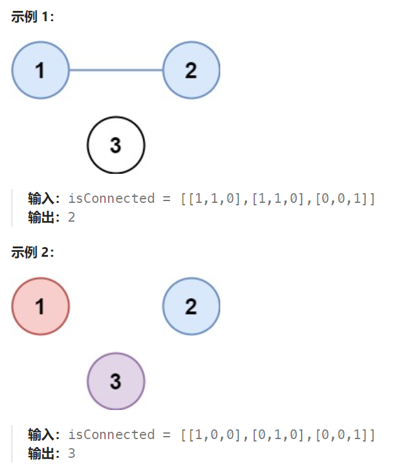

## 题目

有 `n` 个城市，其中一些彼此相连，另一些没有相连。如果城市 `a` 与城市 `b` 直接相连，且城市 `b` 与城市 `c` 直接相连，那么城市 `a` 与城市 `c` 间接相连。

**省份** 是一组直接或间接相连的城市，组内不含其他没有相连的城市。

给你一个 `n x n` 的矩阵 `isConnected` ，其中 `isConnected[i][j] = 1` 表示第 `i` 个城市和第 `j` 个城市直接相连，而 `isConnected[i][j] = 0` 表示二者不直接相连。

返回矩阵中 **省份** 的数量。



## 题解

### 方法一：利用邻接矩阵构建图，然后采用 bfs 或者 dfs

注意此题的邻接矩阵并非标准的，矩阵的每个元素并非表示一条完整的边(起点、终点、权重)。isConnected[i] 表示：节点 i 能否与节点 1,2,……, n 相连（1表示相连，0表示不相连）

```go
func findCircleNum(isConnected [][]int) int {
    g := NewGraph(isConnected)
    visit := make(map[int]bool)  // 标记已经走过的城市
    province := 0   // 记录省份的数量

    var bfs func(int)
    bfs = func(nodeV int) {
        q := make([]int, 0)
        q = append(q, nodeV)

        for len(q) > 0 {
            p := q[0]
            q = q[1:]

            city := g.nodes[p]
            for i := 0; i < len(city.nexts); i++ {
                next := city.nexts[i]
                if !visit[next.val] {   // 未被访问过的新城市
                    visit[next.val] = true
                    q = append(q, next.val)
                }
            }
        }
    }
    for nodeV, _ := range g.nodes {
        if !visit[nodeV] {   // 未访问过的城市，省份数量+1
            province++
            visit[nodeV] = true
            bfs(nodeV)
        }
    }
    return province
}

type Node struct{
    val int
    nexts []*Node  // 相邻节点
}

type Edge struct {
    from int
    to int
}

type Graph struct {
    nodes map[int]*Node
}

// 根据邻接矩阵构建图
func NewGraph(matrix [][]int) *Graph {
    nodes := make(map[int]*Node)
    for i := 0; i < len(matrix); i++ {
        conn := matrix[i]
        for j := 0; j < len(conn); j++ {
            from, to := i, j
            if _, ok := nodes[from]; !ok {
                nodes[from] = &Node{val:from}
            }
            if _, ok := nodes[to]; !ok {
                nodes[to] = &Node{val:to}
            } 
            if from == to || conn[j] == 0 {  // 起点和终点是一个，或者起点和终点并不相连
                continue
            }
            nodes[from].nexts = append(nodes[from].nexts, nodes[to])
        } 
    }
    return &Graph{
        nodes: nodes,
    }
}
```

### 方法二：直接 dfs 或 bfs 或 并查集

因为此题的邻接矩阵比较特殊，一眼就可以看出到底有几个节点。n = len(isConnected)，因此节点就可以用 0~n-1（或者 1~n）来表示

dfs 为例：

```go
func findCircleNum(isConnected [][]int) int {
    n := len(isConnected)
    visit := make(map[int]bool)  // 标记已经走过的城市
    province := 0

    var dfs func(int)
    dfs = func(index int) {
        if visit[index] {   // 该城市已经被访问过了
            return
        }
        visit[index] = true
        conns := isConnected[index]  // 获取该城市与其他城市的连接情况
        for next := 0; next < len(conns); next++ {
            if conns[next] == 1 && index != next{   // 当前城市 index 与 城市 next 相连
                dfs(next)   // 访问该相邻城市 next
            } 
        }
    }
    for i := 0; i < n; i++ {
        if !visit[i] {
            province++
            dfs(i)
        }
    }
    return province
}
```

