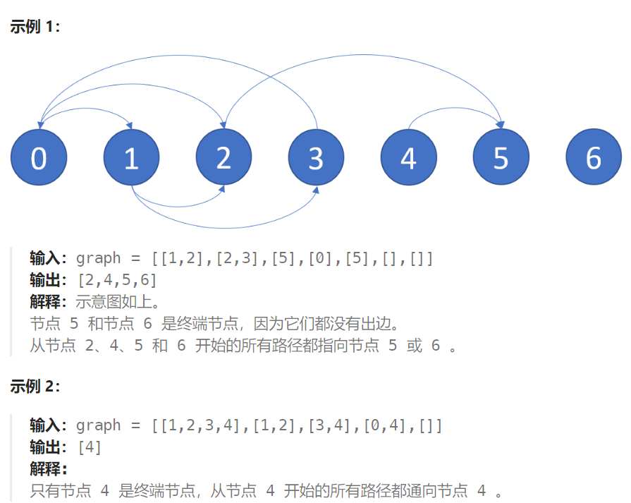

## 题目

有一个有 `n` 个节点的有向图，节点按 `0` 到 `n - 1` 编号。图由一个 **索引从 0 开始** 的 2D 整数数组 `graph`表示， `graph[i]`是与节点 `i` 相邻的节点的整数数组，这意味着从节点 `i` 到 `graph[i]`中的每个节点都有一条边。

如果一个节点没有连出的有向边，则该节点是 **终端节点** 。如果从该节点开始的所有可能路径都通向 **终端节点** ，则该节点为 **安全节点** 。

返回一个由图中所有 **安全节点** 组成的数组作为答案。答案数组中的元素应当按 **升序** 排列。



## 题解

### 方法一：dfs

```go
func eventualSafeNodes(graph [][]int) []int {
    n := len(graph)

    unsafes := make(map[int]bool)  // 存储遇到的非安全节点
    safes := make(map[int]bool)  // 存储遇到的安全节点

    var dfs func(int, map[int]bool) bool
    dfs = func(index int, visit map[int]bool) bool {
        if visit[index] {   // 又回到了之前访问过的节点，则此为环路，无法到达安全节点
            return false
        }
        visit[index] = true   // 标记为已经访问
        for i := 0; i < len(graph[index]); i++ {
            next := graph[index][i]   // 下一个节点
            if unsafes[next] {   // 这个 next 节点是不安全的
                return false  // 一旦出现不安全节点，当前节点一定不安全
            } else if safes[next] {  // 这个 next 节点是安全的
                continue
            } else {   // next 安全性尚未判别
                if !dfs(next, visit) {   // 一旦出现不安全节点，当前节点不安全
                    return false
                }
            }
        }
        safes[index] = true
        return true   // 当前节点的所有 next 都是安全的
    }

    for i := 0; i < n; i++ {
        if len(graph[i]) == 0 {   // 当前节点没有出边，必定安全
            safes[i] = true
        } else if unsafes[i] {   // 当前节点已经被判断为非安全节点
            continue
        } else if safes[i] {   // 当前节点已经被判断为安全节点
            continue
        } else {   // 未判断的节点
            visit := make(map[int]bool)
            if !dfs(i, visit) {
                unsafes[i] = true
            } else {
                safes[i] = true
            }
        }
    }
    res := make([]int ,0)
    for node, _ := range safes {
        res = append(res, node)
    }
    sort.Ints(res)
    return res
}
```


### 方法二：dfs 优化版（三色标记法原理）

可以使用深度优先搜索来找环，并在深度优先搜索时，用三种颜色对节点进行标记，标记的规则如下：

- 白色（用 0 表示）：该节点尚未被访问；

- 灰色（用 1 表示）：该节点位于递归栈中，或者在某个环上；
- 黑色（用 2 表示）：该节点搜索完毕，是一个安全节点。

当我们首次访问一个节点时，将其标记为灰色，并继续搜索与其相连的节点。

如果在搜索过程中遇到了一个灰色节点，则说明找到了一个环，此时退出搜索

如果搜索过程中没有遇到灰色节点，则说明没有遇到环，那么递归返回前，我们将其标记由灰色改为黑色，即表示它是一个安全的节点。

**没有必要在每次 dfs 之前，都将上一轮的访问结果清空：每一轮 dfs 都会产生一些黑色节点和灰色节点，黑色节点自然就是安全节点，而灰色节点则是本轮 dfs 中找到的"非安全节点"，可以直接留给下一轮 dfs 作为判断的依据。**

```go
func eventualSafeNodes(graph [][]int) []int {
    n := len(graph)
    color := make([]int, n)  // 每个节点有三种状态: 0.未访问  1.已访问  2.确定是安全节点
    res := make([]int, 0)

    var safe func(int) bool
    safe = func(i int) bool {
        if color[i] == 1 {   // 当前节点已经访问过，说明出现了环路
            return false
        }
        if color[i] == 2 {     // 当前节点是安全节点
            return true
        }
        color[i] = 1   // 设置访问标记，如果递归发现节点安全，那么值会从 1 变为 2，否则就一直是1
        for j := 0; j < len(graph[i]); j++ {
            next := graph[i][j]   // 下一个要访问的节点
            if !safe(next) {   // 一旦出现不安全节点，整条路径上的节点都不安全,向上访问
                return false
            }
        }
        // 当前节点的所有下一节点都是安全的, 那么当前节点也安全
        color[i] = 2
        return true
    }
    for i := 0; i < n; i++ {
        if safe(i) {   // 该节点是安全节点
            res = append(res, i)
        }
    }
    return res
}
```

