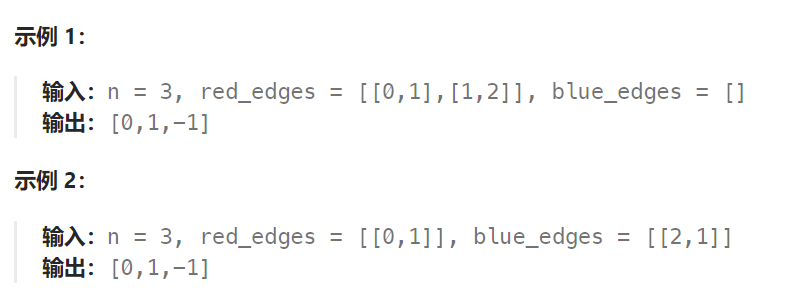

## 题目

给定一个整数 `n`，即有向图中的节点数，其中节点标记为 `0` 到 `n - 1`。图中的每条边为红色或者蓝色，并且可能存在自环或平行边。

给定两个数组 `redEdges` 和 `blueEdges`，其中：

- `redEdges[i] = [ai, bi]` 表示图中存在一条从节点 `ai` 到节点 `bi` 的红色有向边，
- `blueEdges[j] = [uj, vj]` 表示图中存在一条从节点 `uj` 到节点 `vj` 的蓝色有向边。

返回长度为 `n` 的数组 `answer`，其中 `answer[X]` 是从节点 `0` 到节点 `X` 的红色边和蓝色边交替出现的最短路径的长度。如果不存在这样的路径，那么 `answer[x] = -1`。



## 题解

```go
func shortestAlternatingPaths(n int, redEdges [][]int, blueEdges [][]int) []int {
    // g[0][i]: 存储所有以红色边从 i 出发能到达下一个节点
    // g[1][i]: 存储所有以蓝色边从 i 出发能到达下一个节点
    g := [2][][]int{}  
    for i := range g {
        g[i] = make([][]int, n)   // 一共有 n 个节点作为起点
    }
    for _, re := range redEdges {
        start, end := re[0], re[1]
        g[0][start] = append(g[0][start], end)
    }
    for _, be := range blueEdges {
        start, end := be[0], be[1]
        g[1][start] = append(g[1][start], end)
    }
    visit := make([][2]bool, n)  // 记录是否以红色边/蓝色边到达过节点i
    res := make([]int, n)  // res[i]: 记录从 0 出发，到达 i 所需的最少步数(最小步数 == bfs 层数)
    for i := 0; i < n; i ++ {
        res[i] = -1
    }
    type pair struct {
        end int  
        color int
    }

    q := make([]pair, 0)   // 存储上一步走到的节点，同时记录上一步通过何种边(红:0  蓝:1)走到
    q = append(q, pair{0, 0}, pair{0, 1})
    curStep := 0   // 当前走过的步数

    for len(q) > 0 {
        layerCount := len(q)   // 当前步数内能到达的节点数量
        for k := 0; k < layerCount; k++ {   // 每次从队列中取出一层的所有元素(上一步能够到达的所有节点)
            lastEnd := q[0]
            q= q[1:]

            if res[lastEnd.end] == -1 {   // 更新从 0 到 lastEnd 的最少步数（当前 bfs 层数）
                res[lastEnd.end] = curStep
            }
            visit[lastEnd.end][lastEnd.color] = true  // 记录走过的节点以及边情况
            nextColor := 1-lastEnd.color   // 到达下一个节点的边颜色必须相反
            nextStart := lastEnd.end  // 上一个节点将作为新的起点
            
            for _, nextEnd := range g[nextColor][nextStart] {  // 遍历所有可以到达的下一节点
                if !visit[nextEnd][nextColor] {  // 如果还未访问过，将其加入到队列中
                    q = append(q, pair{nextEnd, nextColor})
                }
            }
        }
        curStep++  // 最小步数 == bfs 层数
    }
    return res
}
```

