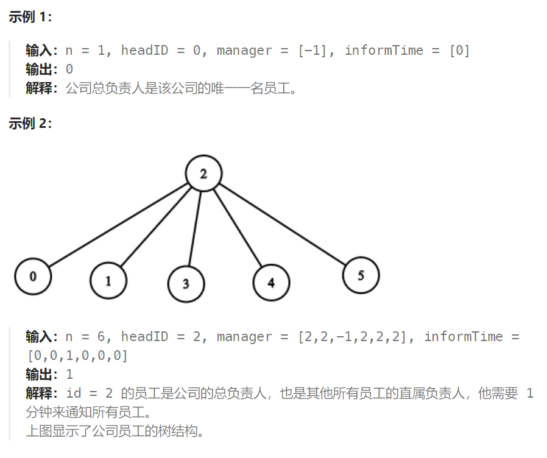

## 题目

公司里有 `n` 名员工，每个员工的 ID 都是独一无二的，编号从 `0` 到 `n - 1`。公司的总负责人通过 `headID` 进行标识。

在 `manager` 数组中，每个员工都有一个直属负责人，其中 `manager[i]` 是第 `i` 名员工的直属负责人。对于总负责人，`manager[headID] = -1`。题目保证从属关系可以用树结构显示。

公司总负责人想要向公司所有员工通告一条紧急消息。他将会首先通知他的直属下属们，然后由这些下属通知他们的下属，直到所有的员工都得知这条紧急消息。

第 `i` 名员工需要 `informTime[i]` 分钟来通知它的所有直属下属（也就是说在 `informTime[i]` 分钟后，他的所有直属下属都可以开始传播这一消息）。

返回通知所有员工这一紧急消息所需要的 **分钟数** 。



## 题解

### 方法一：自底向上

从每个节点出发，直到根节点为止

```go
func numOfMinutes(n int, headID int, manager []int, informTime []int) int {
    spend := 0   // 通知所有员工需要的时间
    spendMap := make(map[int]int)  // 记录从总负责人到当前节点的通知时间
    var dfs func(int) int
    dfs = func(i int) int {
        if manager[i] == -1 {  // 当前节点是总负责人
            return informTime[i]
        }
        res := 0
        if stime, ok := spendMap[i]; ok {  // 从根节点到当前节点的时间已经有记录
            res = stime
        } else {   // 没有记录，需要通过向上递归获得
            res = dfs(manager[i]) // 从根节点到当前节点所需要的时间
            spendMap[i] = res
        }
        res += informTime[i]  // 通知自己下级所需要的时间
        return res    // 将结果返回自己的下级节点
    }

    for i := 0; i < n; i++ {   // 获取每一个节点被通知时的时间
       spend = getMax(spend, dfs(i)) 
    }
    return spend
}
```

### 方法二：自顶向下

根据 子-父 关系表逆向构建 父-子 关系表，然后自顶向下 dfs。从根节点出发，到叶子节点为止。

```go
func numOfMinutes(n int, headID int, manager []int, informTime []int) int {
    childMap := make(map[int][]int)  // 逆向构建 父-子 关系表
    for i := 0; i < len(manager); i++ {
        if manager[i] == -1 {
            continue
        }
        childMap[manager[i]] = append(childMap[manager[i]], i)
    }
    allSpend := 0   // 通知所有节点需要的时间
    curSpend := 0   // 从根节点到当前节点所需的时间
    var dfs func(int)
    dfs = func(i int) {
        if _,ok := childMap[i];!ok {   // 当前节点没有任何子节点(到达叶子节点)
            allSpend = getMax(allSpend, curSpend)
            return
        }
        childs := childMap[i]  // 当前节点的所有孩子节点

        curSpend += informTime[i]  
        for j := 0; j < len(childs); j++ {
            dfs(childs[j])
        }
        // 回溯
        curSpend -= informTime[i]
    }
    dfs(headID)

    return allSpend
}
```

