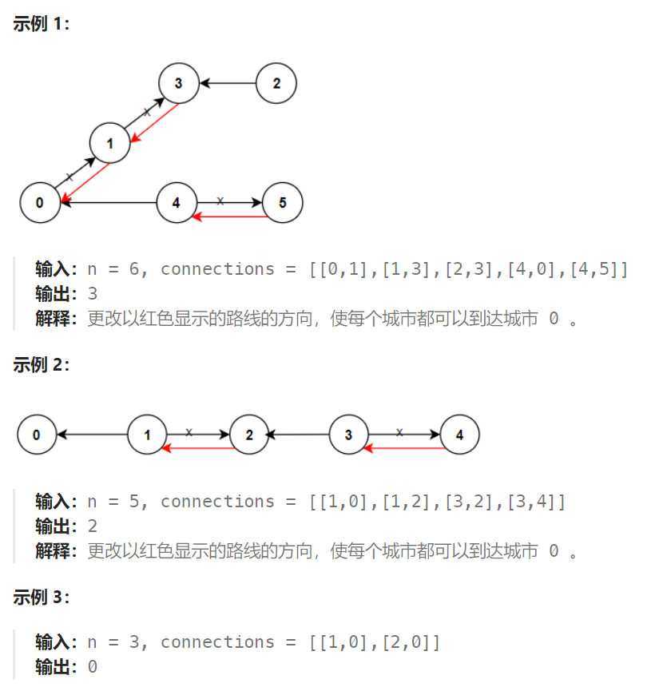

## 题目

`n` 座城市，从 `0` 到 `n-1` 编号，其间共有 `n-1` 条路线。因此，要想在两座不同城市之间旅行只有唯一一条路线可供选择（路线网形成一颗树）。去年，交通运输部决定重新规划路线，以改变交通拥堵的状况。

路线用 `connections` 表示，其中 `connections[i] = [a, b]` 表示从城市 `a` 到 `b` 的一条有向路线。

今年，城市 0 将会举办一场大型比赛，很多游客都想前往城市 0 。

请你帮助重新规划路线方向，使每个城市都可以访问城市 0 。返回需要变更方向的最小路线数。

题目数据 **保证** 每个城市在重新规划路线方向后都能到达城市 0 。



## 题解

从 0 节点开始逆向探索（以每个点为起点进行搜索的代价会很大），使其到达各其他节点。

从 0 到达其他节点 end 的过程中，必须保证从 0 到 end 的使用的全部是虚假路线（就是与原图给定的路线相反的后期添加路线）。因为如果从 0 到其他节点过程中使用了真实路线，说明其他节点不存在真实路线到达 0 。

```go
type pair struct {
    end int   // 终点
    isMock bool  // 是否是虚假添加的边
}
func minReorder(n int, connections [][]int) int {
    // g[i]: 以 i 为起点，到达的其他节点以及使用的路线类型(真实 or 虚假)
    g := make([][]pair, n)
    for i := 0; i < len(connections); i++ {
        c := connections[i]
        start, end := c[0], c[1]
        g[start] = append(g[start], pair{end, false})  // 添加一条从 start 到 end 的真实路线
        g[end] = append(g[end], pair{start, true})  // 人工添加添加一条从 end 到 start 的虚假路线
    }
    res := 0
    visit := make([]bool, n)   // 记录节点是否被访问过
    var bfs func(int)
    bfs = func(i int) {
        q := make([][]pair, 0)
        q = append(q, g[i])
        for len(q) > 0 {
            p := q[0]
            q = q[1:]
            for j := 0; j < len(p); j++ {
                end := p[j].end
                if visit[end] {   // 已经被访问的节点不再重复访问
                    continue
                }
                if !p[j].isMock {   // 从 i 到 end 使用的是真实路线，说明此路线需要反转
                    res++
                    visit[end] = true
                    q = append(q, g[end])
                } else {  // 从 i 到 j 使用的是虚假路线，说明此路线不需要反转
                    visit[end] = true
                    q = append(q, g[end])
                }
            }
        }
    }
    visit[0] = true
    bfs(0)
    return res
}
```

