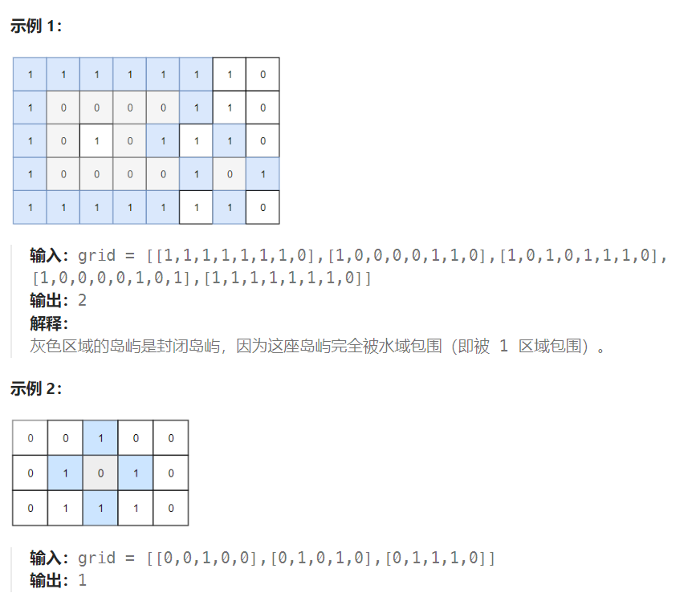

## 题目

二维矩阵 `grid` 由 `0` （土地）和 `1` （水）组成。岛是由最大的4个方向连通的 `0` 组成的群，封闭岛是一个 `完全` 由1包围（左、上、右、下）的岛。

请返回 *封闭岛屿* 的数目。



## 题解

```go
func closedIsland(grid [][]int) int {
    rowMax := len(grid)
    colMax := len(grid[0])

    island := 0  // 封闭岛屿的数量

    var dfs func(int, int) bool
    dfs = func(row, col int) bool {
        if row < 0 || row >= rowMax || col < 0 || col >= colMax {  // 岛屿不是封闭的
            return false
        }
        if grid[row][col] == 1 {  // 周边是海洋，说明被包围
            return true
        }
        if grid[row][col] == 2 {  // 不能重复访问已经访问的陆地(不返回false)
            return true
        }
        grid[row][col] = 2  // 标记已访问

        left := dfs(row-1, col)
        right := dfs(row+1, col)
        up := dfs(row, col-1)
        down := dfs(row, col+1)

        if left && right && up && down {
            return true
        } else {   // 只要上下左右任意一个位置会出界，说明没有1包围，返回false
            return false
        }
        
    }
    // 最外围一圈都不可能是封闭岛屿，直接跳过即可
    for row := 1; row < rowMax-1; row++ {
        for col := 1; col < colMax-1; col++ {
            if grid[row][col] == 0 {   // 未访问过的岛屿
                if dfs(row, col) {
                    island++
                }
            }
        }
    }
    return island
}
```

