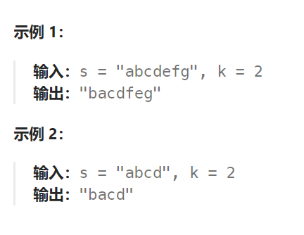

## 题目：

给定一个字符串 `s` 和一个整数 `k`，从字符串开头算起，每计数至 `2k` 个字符，就反转这 `2k` 字符中的前 `k` 个字符。

- 如果剩余字符少于 `k` 个，则将剩余字符全部反转。
- 如果剩余字符小于 `2k` 但大于或等于 `k` 个，则反转前 `k` 个字符，其余字符保持原样。



## 题解：

```go
func reverseStr(s string, k int) string {
    sBytes := []byte(s)
    Len := len(s)
    extra := Len % (2*k)
    for i := 0; i < Len-extra; i+= 2*k {
        reverseString(sBytes[i:i+k])
    }
    if extra == 0 {
        return string(sBytes)
    } else if extra < k {
        sub := sBytes[Len-extra:Len]
        reverseString(sub)
        return string(sBytes)
    } else {
        sub := sBytes[Len-extra:Len-extra+k]
        reverseString(sub)
        return string(sBytes)
    }
}
func reverseString(s []byte)  {
    left, right := 0, len(s)-1
    for left < right {
        tmp := s[right]
        s[right] = s[left]
        s[left] = tmp
        left++
        right--
    }
}
```

