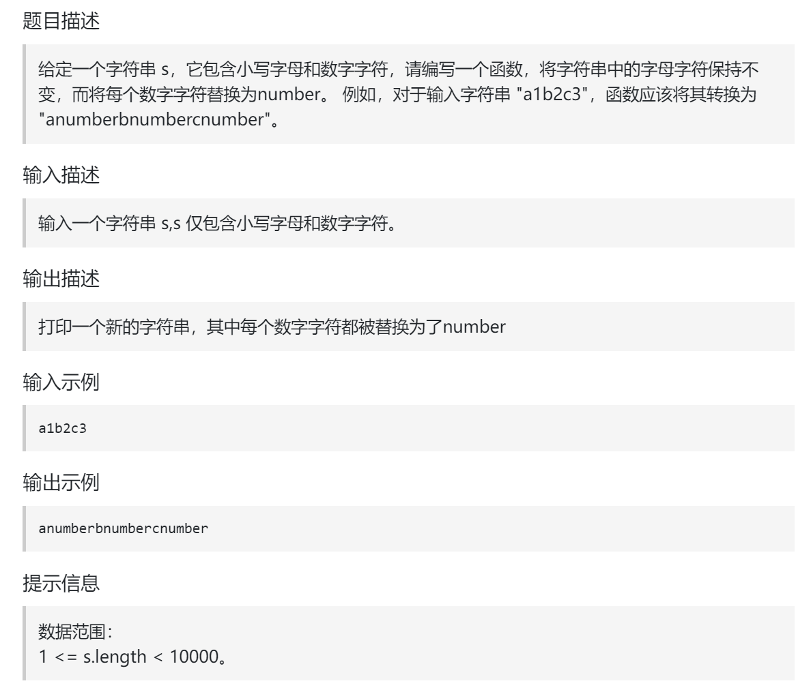

## 题目：



## 题解：

首先扩充数组到每个数字字符替换成 "number" 之后的大小。

例如 字符串 "a5b" 的长度为3，那么 将 数字字符变成字符串 "number" 之后的字符串为 "anumberb" 长度为 8。

如图：


然后从后向前替换数字字符，也就是双指针法，过程如下：i指向新长度的末尾，j指向旧长度的末尾。


```go
func replace(str string) string {
    numCount := 0   // 统计字符串中数字的数目
    for i := 0; i < len(str); i++ {
        if str[i] >= 'a' && str[i] <= 'z' {
            continue
        }
        numCount++
    }
    sp := "number"
    // 新字符串的长度 == "number"的数量 + 小写字母的数量
    newStr := make([]byte, len(sp)*numCount + len(sp) - numCount)  

    ptr1 := len(str) - 1
    ptr2 := len(newStr) - 1
    
    for ; ptr1 >= 0; ptr1-- {
        if str[ptr1] >= 'a' && str[ptr1] <= 'z' {  // 是小写字母，直接复制
            newStr[ptr2] = str[ptr1]
            ptr2--
        } else {   // 是数字，追加一个“number”
            for i := len(sp)-1; i >= 0; i-- {
                newStr[ptr2] = sp[i]
                ptr2--
            }
        }
    }
    return string(newStr)
}
```

