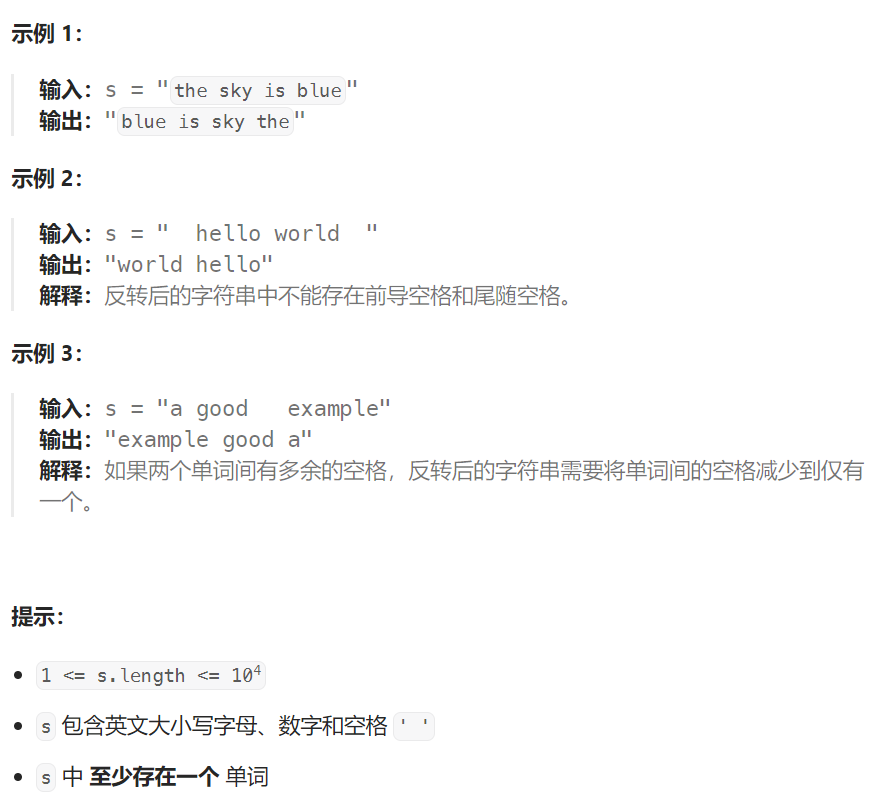

## 题目：

给你一个字符串 `s` ，请你反转字符串中 **单词** 的顺序。

**单词** 是由非空格字符组成的字符串。`s` 中使用至少一个空格将字符串中的 **单词** 分隔开。

返回 **单词** 顺序颠倒且 **单词** 之间用单个空格连接的结果字符串。

**注意：**输入字符串 `s`中可能会存在前导空格、尾随空格或者单词间的多个空格。返回的结果字符串中，单词间应当仅用单个空格分隔，且不包含任何额外的空格。



## 题解：

### 方法一：栈

```go
func reverseWords(s string) string {
    stack := make([]string, 0)
    // 将所有字符串入栈
    for i := 0; i < len(s); i++ {
        word := make([]byte, 0)
        if s[i] == ' ' {
            continue
        } else {  // 找到一个单词的首部
            for i < len(s) && s[i] != ' ' {   // 再遇到空格时单词结束
                word = append(word, s[i])
                i++
            }
            stack = append(stack, string(word))
        }
    }
    // 逆向出栈
    res := ""
    for i := len(stack)-1; i >= 0; i-- {
        res += stack[i]
        if i > 0 {
            res += " "
        }
    }
    return res
}
```

### 方法二：快慢指针 + 反转字符串

```go
func reverseWords(s string) string {
    // 1.处理掉多余的空格（快慢指针）
    newStr := prefix(s)
    // 2.将整个字符串反转
    left, right := 0, len(newStr)-1
    reverseString(newStr, left, right)
    // 3.再将每个单词反转
    lastStart := 0
    for i := 0; i <= len(newStr); i++ {
        if i == len(newStr) || newStr[i] == ' ' {
            reverseString(newStr, lastStart, i-1)
            lastStart = i+1
        }
    }
    return string(newStr)
}
// 预处理, 处理掉所有多余空格(快慢指针法实现)
func prefix(s string) []byte {
    start, end := 0, len(s)-1   // 非空格区域的第一个字母，非空格区域的最后一个字母
    for ; start < len(s); start++ {
        if s[start] == ' ' {
            continue
        } else {
            break
        }
    }
    for ; end >= 0; end-- {
        if s[end] == ' ' {
            continue
        } else {
            break
        }
    }
    slow, fast := start, start
    sBytes := []byte(s)
    for ; fast <= end; fast++ {
        // 当 fast 指向某一个单词后的第 2 个以及之后的空格时, 只有 fast 继续移动, slow 停止不动
        if fast > 0 && sBytes[fast] == sBytes[fast-1] && sBytes[fast] == ' ' {
            continue
        } else {  // fast 重新指向单词，将其交换至 slow 处
            sBytes[slow] = sBytes[fast]
            slow++  // 在遇到单词或者单词后的第一个空格的时候, slow 会向后移动
        }
    }
    return sBytes[start:slow]
}
func reverseString(s []byte, left, right int)  {
    for left < right {
        tmp := s[right]
        s[right] = s[left]
        s[left] = tmp
        left++
        right--
    }
}
```

```java
class Solution {
    public String reverseWords(String s) {
        String prefixedS = prefix(s);

        String reversedS = reverseStrInterver(prefixedS, 0 ,prefixedS.length()-1);

        int lastStart = 0;

        for (int i = 0; i <= reversedS.length(); i++) {
            if (i == reversedS.length() ||  reversedS.charAt(i) == ' ') {
                reversedS = reverseStrInterver(reversedS, lastStart ,i-1);
                lastStart = i+1;
            }
        }
        return reversedS;
    }
    public String reverseStrInterver(String s, int start, int end) {

        char[] chars = s.toCharArray();
        int left = start;
        int right = end > chars.length-1 ? chars.length-1 : end;

        while (left < right) {
            swap(chars, left, right);
            left++;
            right--;
        }
        return new String(chars);
    }

    public void swap(char[] s, int index1, int index2) {
        char temp = s[index1];
        s[index1] = s[index2];
        s[index2] = temp;
    }
    // 去除多余空格
    public String prefix(String s) {
        int start = 0;
        int end = s.length() - 1;

        for (start = 0; start < s.length(); start++) {
            if (s.charAt(start) == ' ') {
                continue;
            } else {
                break;
            }
        }
        for (end = s.length() - 1; end >= 0; end--) {
            if (s.charAt(end) == ' ') {
                continue;
            } else {
                break;
            }
        }

        char[] arr = s.toCharArray();
        int slow = start, fast = start;

        for (fast = start ; fast <= end; fast++) {
            if (fast > 0 && s.charAt(fast) == s.charAt(fast - 1) && s.charAt(fast) == ' ') {
                continue;
            } else {
                arr[slow] = arr[fast];
                slow++;
            }
        }
        
        return new String(arr).substring(start, slow);
    }
}
```

