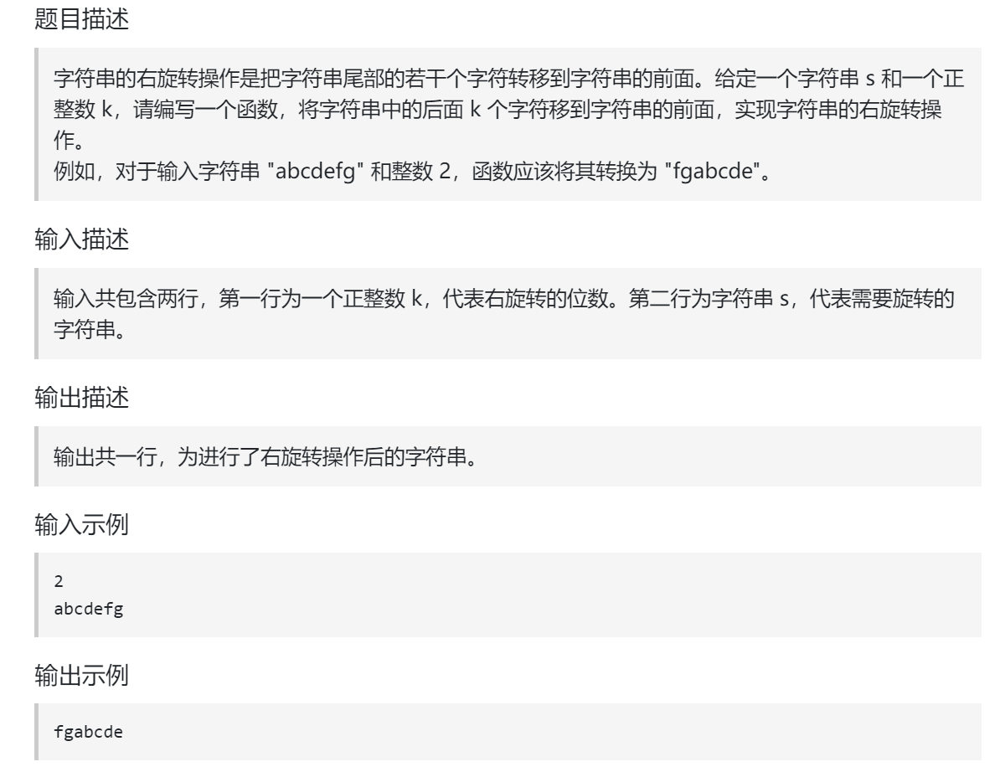

## 题目



为了让本题更有意义，提升一下本题难度：**不能申请额外空间，只能在本串上操作**。 （Java不能在字符串上修改，所以使用 java 一定要开辟新空间）

## 题解

使用 **整体反转+局部反转** 就可以实现反转单词顺序的目的。


```java
import java.util.*;

class Main {
    public static void reverseStrInterver(char[] s, int start, int end) {
        int left = start;
        int right = end > s.length-1 ? s.length-1 : end;

        while (left < right) {
            swap(s, left, right);
            left++;
            right--;
        }
    }
    public static void swap(char[] s, int index1, int index2) {
        char temp = s[index1];
        s[index1] = s[index2];
        s[index2] = temp;
    }
    public static void main(String[] args) {
        Scanner scanner = new Scanner(System.in);

        int k = scanner.nextInt();
        String s = scanner.next();

        char[] arr = s.toCharArray();
        reverseStrInterver(arr, 0, arr.length-1);

        reverseStrInterver(arr, 0, k-1);
        reverseStrInterver(arr, k, arr.length-1);

        System.out.println(new String(arr));

        scanner.close();
    }
}
```

