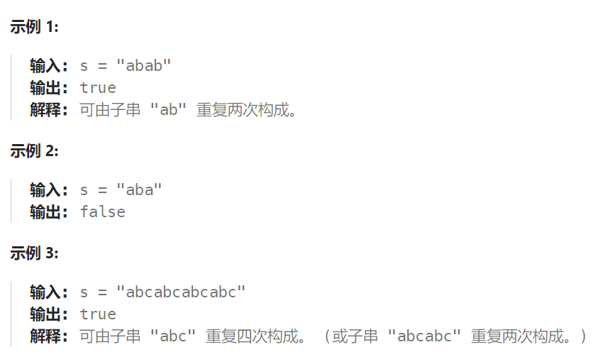

## 题目

给定一个非空的字符串 `s` ，检查是否可以通过由它的一个子串重复多次构成。



## 题解

当一个字符串s：abcabc，内部由重复的子串组成，那么这个字符串的结构一定是这样的：


也就是由前后相同的子串组成。

那么既然前面有相同的子串，后面有相同的子串，用 s + s，这样组成的字符串中，后面的子串做前串，前面的子串做后串，就一定还能组成一个s，如图：


所以判断字符串s是否由重复子串组成，只要两个s拼接在一起，里面还出现一个s的话，就说明是由重复子串组成。

当然，我们在判断 s + s 拼接的字符串里是否出现一个s的的时候，**要刨除 s + s 的首字符和尾字符**，这样避免在s+s中搜索出原来的s，我们要搜索的是中间拼接出来的s。

```go
import "strings"
func repeatedSubstringPattern(s string) bool {
    // 1.获取 s+s 字符串
    newS := []byte(s+s) 
    // 2.去掉头和尾
    newS = newS[1:]
    newS = newS[:len(newS)-1]
    // 3.去掉头和尾后的组合字符串中依然能查询到完整的s
    return strings.Contains(string(newS), s)
}
```