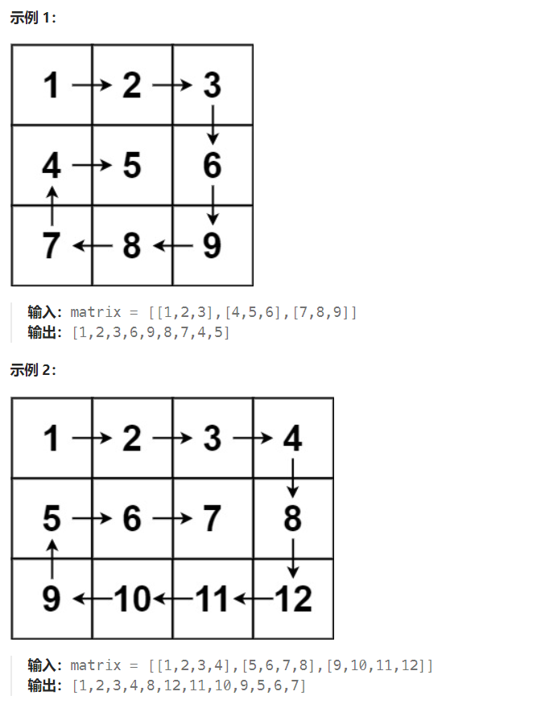

题目：

给你一个 `m` 行 `n` 列的矩阵 `matrix` ，请按照 **顺时针螺旋顺序** ，返回矩阵中的所有元素。



题解：

```go
type pos struct {
    x int
    y int
}

func spiralOrder(matrix [][]int) []int {
    m := len(matrix)
    n := len(matrix[0])
    leftUp := pos{0, 0}  // 左上角
    rightDown := pos{m-1, n-1}   // 右下角

    res := make([]int, m*n)
    curNum := 0

    for {
        if leftUp.x > rightDown.x { // 左上角在右下角的下方
            break
        }
        if leftUp.y > rightDown.y { // 左上角在右下角的右方
            break
        }
        if leftUp.x == rightDown.x {  // 在同一行
            for i := leftUp.y; i <= rightDown.y; i++ {
                res[curNum] = matrix[leftUp.x][i]
                curNum++
            }
            break
        }
        if leftUp.y == rightDown.y {  // 在同一列
            for i := leftUp.x; i <= rightDown.x; i++ {
                res[curNum] = matrix[i][leftUp.y]
                curNum++
            }
            break
        }
        // 1. 生成上行
        for i := leftUp.y; i < rightDown.y; i++ {
            res[curNum] = matrix[leftUp.x][i]
            curNum++
        }
        // 2. 生成右列
        for i := leftUp.x; i < rightDown.x; i++ {
            res[curNum] = matrix[i][rightDown.y]
            curNum++
        }
        // 3. 生成下行
        for i := rightDown.y; i > leftUp.y; i-- {
            res[curNum] = matrix[rightDown.x][i]
            curNum++
        }
        // 4. 生成左列
        for i := rightDown.x; i > leftUp.x; i-- {
            res[curNum] = matrix[i][leftUp.y]
            curNum++
        }
        leftUp.x++
        leftUp.y++
        rightDown.x--
        rightDown.y--
    }

    return res
}
```

