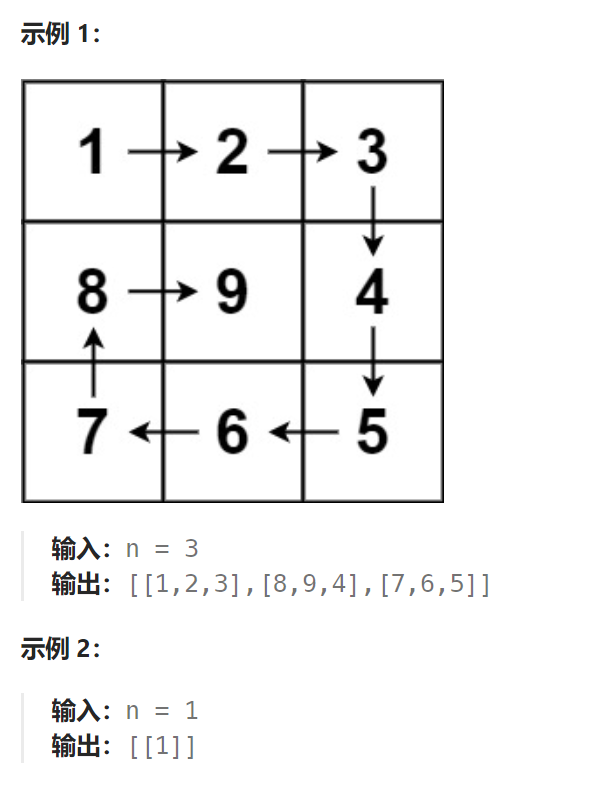

题目：

给你一个正整数 `n` ，生成一个包含 `1` 到 `n2` 所有元素，且元素按顺时针顺序螺旋排列的 `n x n` 正方形矩阵 `matrix` 。



题解：

```go
type pos struct {
    x int
    y int
}

func generateMatrix(n int) [][]int {
    leftUp := pos{0, 0}  // 左上角
    rightDown := pos{n-1, n-1}   // 右下角

    matrix := make([][]int, n)
    for i := 0; i < n; i++ {
        matrix[i] = make([]int, n)
    }
    curV := 1
    for {
        if leftUp.x > rightDown.x { // 左上角在右下角的下方
            break
        }
        if leftUp.y > rightDown.y { // 左上角在右下角的右方
            break
        }
        if leftUp.x == rightDown.x {  // 在同一行
            for i := leftUp.y; i <= rightDown.y; i++ {
                matrix[leftUp.x][i] = curV
                curV++
            }
            break
        }
        if leftUp.y == rightDown.y {  // 在同一列
            for i := leftUp.x; i <= rightDown.x; i++ {
                matrix[i][leftUp.y] = curV
                curV++
            }
            break
        }
        // 1. 生成上行
        for i := leftUp.y; i < rightDown.y; i++ {
            matrix[leftUp.x][i] = curV
            curV++
        }
        // 2. 生成右列
        for i := leftUp.x; i < rightDown.x; i++ {
            matrix[i][rightDown.y] = curV
            curV++
        }
        // 3. 生成下行
        for i := rightDown.y; i > leftUp.y; i-- {
            matrix[rightDown.x][i] = curV
            curV++
        }
        // 4. 生成左列
        for i := rightDown.x; i > leftUp.x; i-- {
            matrix[i][leftUp.y] = curV
            curV++
        }
        leftUp.x++
        leftUp.y++
        rightDown.x--
        rightDown.y--
    }

    return matrix
}
```

