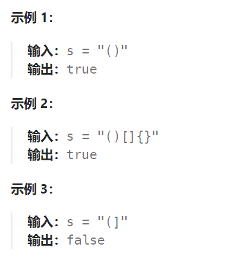

## 题目

给定一个只包括 `'('`，`')'`，`'{'`，`'}'`，`'['`，`']'` 的字符串 `s` ，判断字符串是否有效。

有效字符串需满足：

1. 左括号必须用相同类型的右括号闭合。
2. 左括号必须以正确的顺序闭合。
3. 每个右括号都有一个对应的相同类型的左括号。



## 题解

```go
func isValid(s string) bool {
    if len(s) == 0 {
        return true
    }
    stack := []byte{}
    for i:=0; i<len(s); i++ {
        cur := s[i]
        if len(stack) == 0{
            stack = append(stack, cur)
            continue
        }
        top := stack[len(stack)-1]   // 拿到栈顶元素
        if top == '(' && cur == ')' {    // 小括号对消
            stack = stack[:len(stack)-1]  
            continue
        } else if top == '[' && cur == ']' {  // 中括号对消
            stack = stack[:len(stack)-1]  
            continue           
        } else if top =='{' && cur == '}' {  // 花括号对消
            stack = stack[:len(stack)-1]  
            continue
        } else {    // 其余无法对消的情况, 直接将新的括号追加到栈顶
            stack = append(stack, cur)
        }
    }
    if len(stack) == 0 {
        return true
    } else {
        return false
    }
}
```

