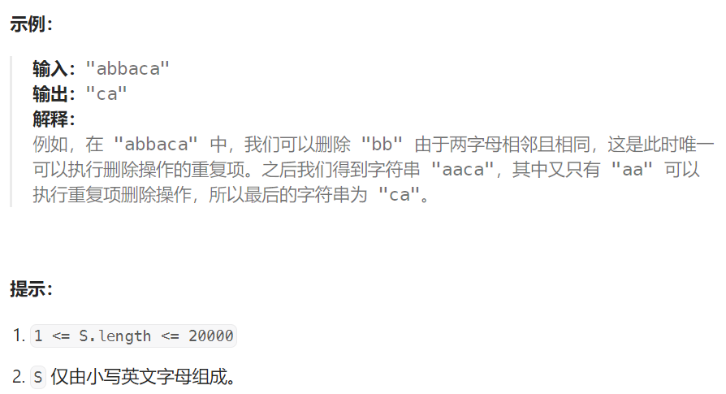

## 题目

给出由小写字母组成的字符串 `S`，**重复项删除操作**会选择两个相邻且相同的字母，并删除它们。

在 S 上反复执行重复项删除操作，直到无法继续删除。

在完成所有重复项删除操作后返回最终的字符串。答案保证唯一。



## 题解

可以用栈，也可以用队列。用队列会更加方便，因为用栈的话最后还需要将剩余元素挨个弹出（因为是逆序）。

```go
func removeDuplicates(s string) string {
    q := make([]byte, 0)
    for i := 0; i < len(s);i++ {
        if len(q) == 0 {
            q = append(q, s[i])
            continue
        }
        if q[len(q)-1] == s[i] {  // 队列的最后一个字母恰好等于新的字母, 对消掉
            q = q[:len(q)-1]
        } else {
            q = append(q, s[i])
        }
    }
    return string(q)
}
```

