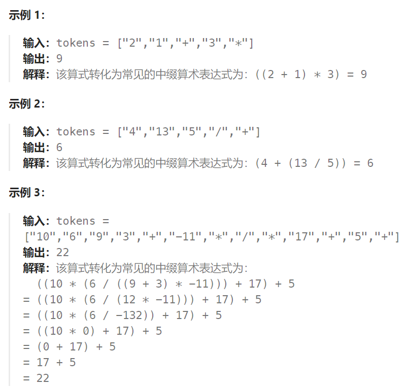

## 题目

给你一个字符串数组 `tokens` ，表示一个根据 [逆波兰表示法](https://baike.baidu.com/item/逆波兰式/128437) 表示的算术表达式。

请你计算该表达式。返回一个表示表达式值的整数。

**注意：**

- 有效的算符为 `'+'`、`'-'`、`'*'` 和 `'/'` 。
- 每个操作数（运算对象）都可以是一个整数或者另一个表达式。
- 两个整数之间的除法总是 **向零截断** 。
- 表达式中不含除零运算。
- 输入是一个根据逆波兰表示法表示的算术表达式。
- 答案及所有中间计算结果可以用 **32 位** 整数表示。



## 题解

此题需要用栈解决，而不能用队列。因此每次需要选中最后两个获取到的数字先进行计算（也就是后进先出原则）

解决思路如下，也是与上题一样的 "对消" 思想。


```go
func evalRPN(tokens []string) int {
    q := make([]int, 0)   
    for i := 0; i < len(tokens); i++ {
        token := tokens[i]
        // token 如果是数字就将其加入到栈中
        if token != "+" && token != "-" && token != "*" && token != "/" {
            num,_ := strconv.Atoi(token)
            q = append(q, num)
        } else if token == "+" {
            num1, num2 := q[len(q)-2],q[len(q)-1]   // 从栈顶弹出两个数
            q = q[:len(q)-2]
            q = append(q, num1 + num2)
        } else if token == "-" {    // 减法有顺序要求 q[len(q)-2]是被减数, q[len(q)-1]是减数
            num1, num2 := q[len(q)-2],q[len(q)-1]
            q = q[:len(q)-2]
            q = append(q, num1 - num2)
        } else if token == "*" {
            num1, num2 := q[len(q)-2],q[len(q)-1]
            q = q[:len(q)-2]
            q = append(q, num1 * num2)
        } else {  // token == "/"   除法也有顺序要求
            num1, num2 := q[len(q)-2],q[len(q)-1]
            q = q[:len(q)-2]
            q = append(q, num1 / num2)
        }
    }
    return q[0]
}
```

