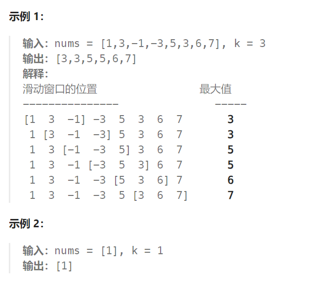

## 题目：

给你一个整数数组 `nums`，有一个大小为 `k` 的滑动窗口从数组的最左侧移动到数组的最右侧。你只可以看到在滑动窗口内的 `k` 个数字。滑动窗口每次只向右移动一位。

返回 滑动窗口中的最大值 。



## 题解：

### 方法一：直接使用滑动窗口解决

直接使用滑动窗口，每次对窗口内的切片求最大值，这样会导致整体超时：

```go
import "math"
func maxSlidingWindow(nums []int, k int) []int {
    if len(nums) <= k {
        return []int{getMax(nums)}
    }
    maxVals := make([]int, 0)   // 保存每次窗口中元素的最大值
    curWin := make([]int, 0)   // 当前窗口中的元素
    start := 0
    for end := 0; end < len(nums); end++ {
        num := nums[end]
        curWin = append(curWin, num)

        if len(curWin) == k {  // 窗口的长度现在为 k
            maxVal := getMax(curWin)   // 获取一次窗口最大值(这里是超时的原因)
            maxVals = append(maxVals, maxVal)
            curWin = curWin[1:]   // 窗口中删除掉第一个元素(也就是 nums[start] )
            start++
        }
        // end 已经到达末尾, start ~ end 之间的元素不足 k 个，可以结束循环了
        if end == len(nums) - 1 && end - start + 1 < k {  
            break
        }
    }
    return maxVals
}

// 返回切片中的最大值
func getMax(arr []int) int {
    max := math.MinInt
    for i := 0; i < len(arr); i++ {
        if arr[i] > max {
            max = arr[i]
        }
    }
    return max
}
```

### 方法二：滑动窗口 + 单调队列

我们需要一个队列，这个队列呢，放进去窗口里的元素，然后随着窗口的移动，队列也一进一出，每次移动之后，队列告诉我们窗口里面的最大值是什么。

这个队列应该是这个样子：每次窗口移动的时候，调用que.pop(滑动窗口中移除元素的数值)，que.push(滑动窗口添加元素的数值)，然后que.front()就返回我们要的最大值。

再分析一下，队列里的元素一定是要排序的，而且要最大值放在出队口，要不然怎么知道最大值呢。

但如果把窗口里的元素都放进队列里，窗口移动的时候，队列需要弹出元素。

那么问题来了，已经排序之后的队列 怎么能把窗口要移除的元素（这个元素可不一定是最大值）弹出呢。

**其实队列没有必要维护窗口里的所有元素，只需要维护有可能成为窗口里最大值的元素就可以了，同时保证队列里的元素数值是由大到小的。**

那么这个维护元素单调递减的队列就叫做**单调队列，即单调递减或单调递增的队列。**

来看一下单调队列如何维护队列里的元素：


对于窗口里的元素{2, 3, 5, 1 ,4}，单调队列里只维护{5, 4} 就够了，保持单调队列里单调递减，此时队列出口元素就是窗口里最大元素。

```go
func maxSlidingWindow(nums []int, k int) []int {
    maxVals := make([]int, 0)   // 保存每次窗口中元素的最大值
    start := 0
    q := NewQueue()   // 单调队列(从左向右递减)
    // 先将前 k 个元素入窗口（同时入单调队列）
    for i := 0; i < k; i++ {
        q.Push(nums[i])
    }
    maxVals = append(maxVals, q.Front().(int))  // 前 k 个元素的最大值
    for end := k; end < len(nums); end++ {
        // 每次移动，将 nums[start] 移除窗口, nums[end] 移入窗口
        if nums[start] == q.Front() {  // 防止要移除的 nums[start] 是单调队列的最大值
            q.Pop()
        }
        start++
        q.Push(nums[end])
        maxVals = append(maxVals, q.Front().(int))
    }
    return maxVals
}
// 单调队列
type Queue struct {
	Items []int // 元素从左向右是递减的
	Len   int
}
func NewQueue() *Queue {
	return &Queue{
		Items: make([]int, 0),
		Len:   0,
	}
}
// 入队列时，将所有小于 data 的元素全部剔除
func (q *Queue) Push(data int) {
    for {
        if q.Len == 0 {
            q.Items = append(q.Items, data)
            q.Len++
            break
        }
        if q.Items[q.Len-1] < data {
            q.Items = q.Items[:len(q.Items)-1]
            q.Len--
        } else {
            q.Items = append(q.Items, data)
            q.Len++
            break
        }
    }
}
// 出队列时，总是弹出队列中的最大值
func (q *Queue) Pop() int {
	data := q.Items[0]
	q.Items = q.Items[1:] // 删除出队列的元素
	q.Len--
	return data
}
// 返回队列中的最大值
func (q *Queue) Front() interface{} {
    if q.Empty() {
        return nil
    } else {
        return q.Items[0]
    }
}
func (q *Queue) Size() int {
	return q.Len
}
func (q *Queue) Empty() bool {
	return q.Size() == 0
}
```

> 单调队列不能直接使用 Java 的 优先队列 PriorityQueue，它是堆结构实现的，不能做到弹出比起小的队列已有元素。
>
> 可以用双端队列 Deque 自行实现单调队列

```java
class Solution {
    public static class Queue {
        Deque<Integer> dq;
        public Queue() {
            dq = new LinkedList<>();
            this.dq = dq;
        }
        public void add(int i) {
            while (!dq.isEmpty() && dq.getLast() < i)  // 不断弹出比 i 小的队列元素
                dq.removeLast();
            dq.addLast(i);
        }
        public int poll() {
            return dq.poll();
        }
        public int peek() {
            return dq.peek();
        }
    }
    
    public static  int[] maxSlidingWindow(int[] nums, int k) {
        Queue queue = new Queue();
        // 前 k 个元素进入优先级队列
        for (int i = 0; i < k; i++) {
            queue.add(nums[i]);
        }
        List<Integer> res = new ArrayList<>();
        res.add(queue.peek());   // 获取前 k 个元素中的最大值
        int start = 0;

        for (int end = k; end < nums.length; end++) {
            if (nums[start] == queue.peek()) {   // start 是前 k 个元素中的最大值，需要将 start 从单调队列移除
                queue.poll();
            }
            start++;

            queue.add(nums[end]);    // 将 end 加入单调队列
            res.add(queue.peek());   // 获取当前窗口的最大值
        }
        return res.stream().mapToInt(Integer::intValue).toArray();
    }

    public static void main(String[] args) {
        int[] nums = {9,10,9,-7,-4,-8,2,-6};
          maxSlidingWindow(nums, 5);
    }
}
```

