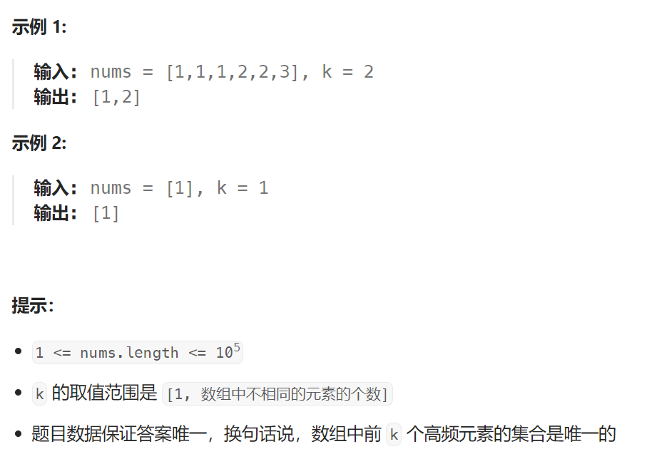

## 题目

给你一个整数数组 `nums` 和一个整数 `k` ，请你返回其中出现频率前 `k` 高的元素。你可以按 **任意顺序** 返回答案。



## 题解

### 方法一：快速排序

```go

import "sort"

type kv struct {
    num int
    count int
}


func topKFrequent(nums []int, k int) []int {
    countMap := make(map[int]int)
    for i := 0; i < len(nums); i++ {
        countMap[nums[i]]++
    }
	// 排序无法对 map 进行排序，因此要把 map 转化为结构体切片
    kvSet := make([]kv, 0)
    for num, count := range countMap {
        kvSet = append(kvSet, kv{num, count})
    }
	// 按照出现次数降序排序
    sort.Slice(kvSet, func (i, j int) bool {return kvSet[i].count > kvSet[j].count})
    // 获取前 k 个出现次数最高的元素
    res := make([]int, k)
    for i := 0; i < k; i++ {
        res[i] = kvSet[i].num
    }
    return res
}
```

### 方法二：大根堆

```go

import (
	"container/heap"
)

type kv struct {
    num int
    count int
}

func topKFrequent(nums []int, k int) []int {
    // 1.使用哈希表统计词频
    countMap := make(map[int]int)
    for i := 0; i < len(nums); i++ {
        countMap[nums[i]]++
    }
    // 2.用结构体切片重新记录哈希表数据，该切片将作为大根堆
    kvSet := make([]kv, 0)
    for num, count := range countMap {
        kvSet = append(kvSet, kv{num, count})
    }
    res := make([]int, 0)

    kh := NewKVHeap(kvSet)
    // 3.将其生成为一个大根堆
    heap.Init(kh)  
    for i := 0; i < k; i++ {
        mostKV := heap.Pop(kh)   // 每次弹出一个出现次数最多的 kv
        res = append(res, mostKV.(kv).num)
    }
    return res
}

// 一个大根堆
type kvHeap struct {
    heap []kv
}

func NewKVHeap(kvSet []kv) *kvHeap {
    return &kvHeap{
        heap : kvSet,
    }
}

func (kh *kvHeap) Less(i, j int) bool {
    return kh.heap[i].count > kh.heap[j].count   // 降序顺序
}

func (kh *kvHeap) Len() int {
    return len(kh.heap)
}

func (kh *kvHeap) Swap(i, j int) {
    kh.heap[i], kh.heap[j] = kh.heap[j], kh.heap[i]
}

func (kh *kvHeap) Push(x interface{}) {
    kh.heap = append(kh.heap, x.(kv))
}

func (kh *kvHeap) Pop() interface{} {
    n := len(kh.heap) - 1
    // 弹出底层数组的最后一个元素
    res := kh.heap[n]
    kh.heap = kh.heap[:n]
    return res
}
```

### 方法三：小根堆

```go

import (
	"container/heap"
)

type kv struct {
    num int
    count int
}

func topKFrequent(nums []int, k int) []int {
    // 1.使用哈希表统计词频
    countMap := make(map[int]int)
    for i := 0; i < len(nums); i++ {
        countMap[nums[i]]++
    }
    // 2.构建一个小根堆
    kh := NewKVHeap(make([]kv, 0))
    heap.Init(kh) 
    for num, count := range countMap {
        heap.Push(kh, kv{num, count})
        if kh.Size() > k {   // 保证小根堆的节点数目 == k
            heap.Pop(kh)  // 弹出堆顶, 也就是出现次数最少的一个节点, 因为其下面的k个节点出现次数都比他高, 它不可能是前k个高频元素
        }
    }
    res := make([]int, 0)

    for i := 0; i < k; i++ {
        curKV := heap.Pop(kh)   // 每次弹出一个出现次数第 k-i 大的 kv
        res = append(res, curKV.(kv).num)
    }
    return res
}

// 一个大根堆
type kvHeap struct {
    heap []kv
}

func NewKVHeap(kvSet []kv) *kvHeap {
    return &kvHeap{
        heap : kvSet,
    }
}

func (kh *kvHeap) Less(i, j int) bool {
    return kh.heap[i].count < kh.heap[j].count   // 升序顺序
}

func (kh *kvHeap) Len() int {
    return len(kh.heap)
}

func (kh *kvHeap) Swap(i, j int) {
    kh.heap[i], kh.heap[j] = kh.heap[j], kh.heap[i]
}

func (kh *kvHeap) Push(x interface{}) {
    kh.heap = append(kh.heap, x.(kv))
}

func (kh *kvHeap) Pop() interface{} {
    n := len(kh.heap) - 1
    // 弹出底层数组的最后一个元素
    res := kh.heap[n]
    kh.heap = kh.heap[:n]
    return res
}

func (kh *kvHeap) Size () int {
    return len(kh.heap)
}
```

