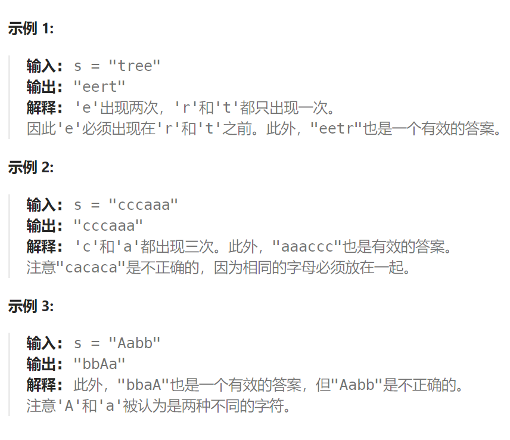
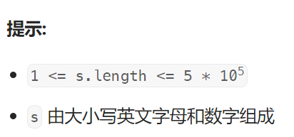

## 题目

给定一个字符串 `s` ，根据字符出现的 **频率** 对其进行 **降序排序** 。一个字符出现的 **频率** 是它出现在字符串中的次数。

返回 *已排序的字符串* 。如果有多个答案，返回其中任何一个。





## 题解

### 方法一：大根堆

```go
import "container/heap"
type charFre struct {
    char byte
    count int
}
func frequencySort(s string) string {
    countMap := make(map[byte]int)   // 统计每个字符出现的次数
    for i := 0; i < len(s); i++ {
        countMap[s[i]]++
    }
    charFreSet := make([]charFre, 0)
    for char, fre := range countMap {
        charFreSet = append(charFreSet, charFre{char, fre})
    }
    kh := NewKVHeap(charFreSet)
    // 转化为一个大根堆
    heap.Init(kh)

    res := make([]byte, 0)
    for kh.Len() > 0 {
        ele := heap.Pop(kh).(charFre)   // 弹出一个出现次数最高的字符
        for i := 0; i < ele.count; i++ {
            res = append(res, ele.char)
        }
    }
    return string(res)
}

type kvHeap struct {
    heap []charFre
}
func NewKVHeap(arr []charFre) *kvHeap {
    return &kvHeap{
        heap: arr,
    }
}
func (kh *kvHeap) Len() int {
    return len(kh.heap)
}
func (kh *kvHeap) Swap(i, j int) {
    kh.heap[i], kh.heap[j] = kh.heap[j], kh.heap[i]
}
func (kh *kvHeap) Less(i, j int) bool {
    return kh.heap[i].count > kh.heap[j].count
}
func (kh *kvHeap) Push(x interface{}) {
    kh.heap = append(kh.heap, x.(charFre))
}
func (kh *kvHeap) Pop() interface{} {
    n := len(kh.heap)-1
    end := kh.heap[n]
    kh.heap = kh.heap[:n]
    return end
}
```

