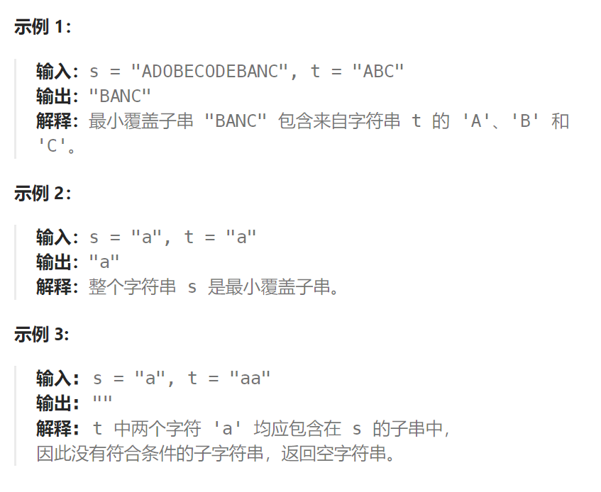

题目：

给你一个字符串 `s` 、一个字符串 `t` 。返回 `s` 中涵盖 `t` 所有字符的最小子串。如果 `s` 中不存在涵盖 `t` 所有字符的子串，则返回空字符串 `""` 。

**注意：**

- 对于 `t` 中重复字符，我们寻找的子字符串中该字符数量必须不少于 `t` 中该字符数量。
- 如果 `s` 中存在这样的子串，我们保证它是唯一的答案。



题解：

```go
func minWindow(s string, t string) string {
    tMap := make(map[byte]int)  // t 中每个字符出现的次数
    for i:=0; i < len(t); i++ {
        tMap[t[i]]++
    }
    resLeft, resRight := -1,-1
    length := math.MaxInt

    start, end := 0,0
    curSMap := make(map[byte]int)  // 统计s的当前子串各个字符出现的次数
    var check func() bool
    check = func() bool {
        for char, count := range tMap {
            if curSMap[char] < count {
                return false
            }
        }
        return true
    }
    for ; end < len(s); end++ {
        // 优化项
        // if tMap[s[end]] == 0 {   // 如果该字符在t中没有出现过，可以跳过
        //     continue
        // }
        curSMap[s[end]]++
        for check() && start <= end {
            // tMap 出现的字符, curSMap都有, 且出现次数相等或更多
            if length > (end - start + 1) {
                length = end - start + 1
                resLeft, resRight = start, end
            }
            curSMap[s[start]]--
            start++
        }
    }
    if resLeft == -1 {  // s 中找不到任何符合条件的子串
        return ""
    }
    return s[resLeft:resRight+1]
}
```

