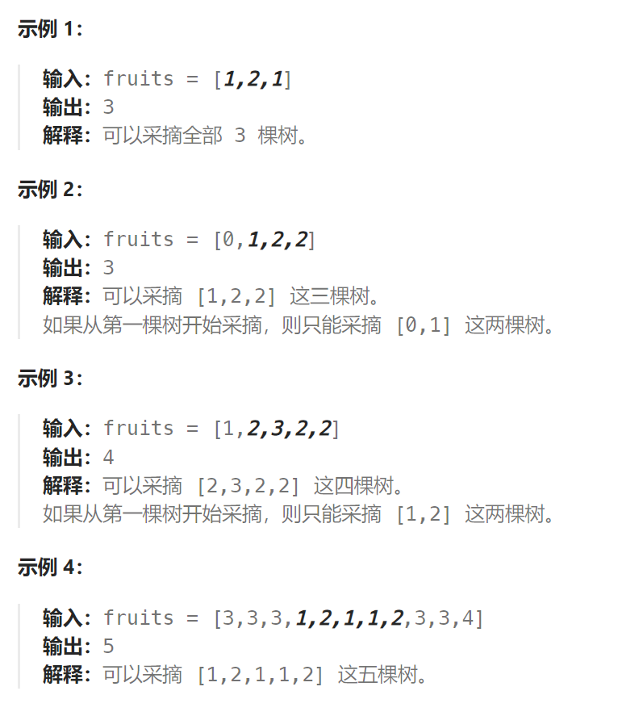

题目：

你正在探访一家农场，农场从左到右种植了一排果树。这些树用一个整数数组 `fruits` 表示，其中 `fruits[i]` 是第 `i` 棵树上的水果 **种类** 。

你想要尽可能多地收集水果。然而，农场的主人设定了一些严格的规矩，你必须按照要求采摘水果：

- 你只有 **两个** 篮子，并且每个篮子只能装 **单一类型** 的水果。每个篮子能够装的水果总量没有限制。
- 你可以选择任意一棵树开始采摘，你必须从 **每棵** 树（包括开始采摘的树）上 **恰好摘一个水果** 。采摘的水果应当符合篮子中的水果类型。每采摘一次，你将会向右移动到下一棵树，并继续采摘。
- 一旦你走到某棵树前，但水果不符合篮子的水果类型，那么就必须停止采摘。

给你一个整数数组 `fruits` ，返回你可以收集的水果的 **最大** 数目。



题解：

```go
func totalFruit(fruits []int) int {
    // 两个装不同类型水果的篮子，可以认为最多装两种类型水果的篮子
    bucket := 0
    start := 0   // 滑动窗口的起点
    curNum := 0  // 滑动窗口内水果的数量
    kindMap := make(map[int]int)  // 统计窗口内每种水果的数量

    for end := 0; end < len(fruits); end++ {
        curKind := fruits[end]   // 当前水果的类型
        kindMap[curKind]++   // 对应类型的水果的数量+1
        // 若滑动窗口内水果的种类 > 2。 就需要不断移动start,直到水果类型 == 2 
        // 注意：此处for循环调整start的原因是重新让窗口内恢复正常
        for len(kindMap) > 2 {   
            kind := fruits[start]
            kindMap[kind]--
            if kindMap[kind] == 0 {
                delete(kindMap, kind)
            }
            start++
        }
        curNum = end - start + 1
        bucket = getMax(bucket, curNum)
    }
    return bucket
}
func getMax(a, b int) int {
    if a > b {
        return a
    } else {
        return b
    }
}
```

