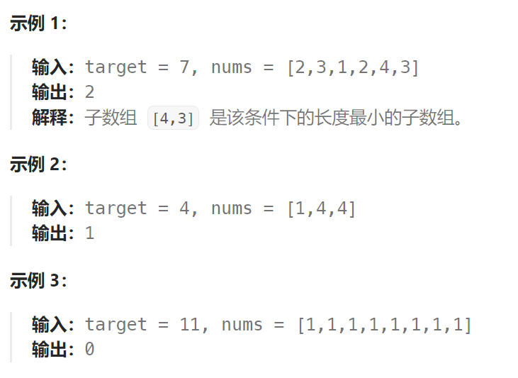

## 题目：

给定一个含有 `n` 个正整数的数组和一个正整数 `target` **。**

找出该数组中满足其总和大于等于 `target` 的长度最小的 **连续子数组** `[numsl, numsl+1, ..., numsr-1, numsr]` ，并返回其长度**。**如果不存在符合条件的子数组，返回 `0` 。



## 思路：

### 1. 暴力解法

这道题目暴力解法当然是 两个for循环，第一个 for 循环遍历子数组的起点，第二个 for 循环遍历子数组的终点，不断的寻找符合条件的子序列，时间复杂度很明显是O(n^2)。

### 2. 滑动窗口

接下来就开始介绍数组操作中另一个重要的方法：**滑动窗口**。

所谓滑动窗口，**就是不断的调节子序列的起始位置和终止位置，从而得出我们要想的结果**。

在暴力解法中，是**一个for循环滑动窗口的起始位置**，**一个for循环为滑动窗口的终止位置**，用两个for循环 完成了一个不断搜索区间的过程。

那么**滑动窗口**如何**用一个for循环来完成这个操作**呢。

首先要思考 如果用一个for循环，那么应该表示 滑动窗口的起始位置，还是终止位置。

如果只用一个for循环来表示 滑动窗口的起始位置，那么如何遍历剩下的终止位置？

此时难免再次陷入 暴力解法的怪圈。

所以 **只用一个for循环，那么这个循环的索引，一定是表示 滑动窗口的终止位置**。

那么问题来了， **滑动窗口的起始位置如何移动**呢？

这里还是以题目中的示例来举例，s=7， 数组是 2，3，1，2，4，3，来看一下查找的过程：


最后找到 4，3 是最短长度的连续子数组。

其实从动画中可以发现滑动窗口也可以理解为双指针法的一种！只不过这种解法更像是一个窗口的移动，所以叫做滑动窗口更适合一些。

在本题中实现滑动窗口，主要确定如下三点：

- 窗口内是什么？
- 如何移动窗口的起始位置？
- 如何移动窗口的结束位置？

1. 窗口就是： 满足其和 ≥ s 的长度最小的 连续 子数组。

2. 窗口的起始位置如何移动：**如果当前窗口的值大于s了，窗口就要向前移动了**（也就是该缩小了）。

3. 窗口的结束位置如何移动：**窗口的结束位置就是遍历数组的指针，也就是for循环里的索引**。

**滑动窗口问题**解题的关键在于 **窗口的起始位置如何移动**，如图所示：


**滑动窗口的精妙之处在于根据当前子序列和大小的情况，不断调节子序列的起始位置。从而将O(n^2)暴力解法降为O(n)。**

```go
func minSubArrayLen(target int, nums []int) int {
    start, end := 0,0  // 滑动窗口的起点和终点
    minLen := math.MaxInt  // 符合条件的连续子数组的最小长度
    sum := 0  // 滑动窗口内元素之和
    curLen := 0  // 滑动窗口的长度
    // 控制滑动窗口的终点
    for ; end < len(nums); end++ {
        sum += nums[end]
        // 当滑动窗口内子序列之和 >= target 时触发:
        // 1.更新 minLen，因为这是符合条件的连续子数组
        // 2.滑动窗口的起点向后移动，实现遍历起点的效果  
        // 此处for循环调整 start 的目的是为了找到最短的满足条件的子数组
        for sum >= target && start <= end{   
            curLen = end - start + 1
            minLen = getMin(minLen, curLen)
            sum -= nums[start]
            start++
        }
    }
    if minLen == math.MaxInt {
        return 0
    } else {
        return minLen
    }    
}
func getMin(a int, b int) int {
    if a < b {
        return a
    } else {
        return b
    }
}
```

```java
class Solution {
    public int minSubArrayLen(int target, int[] nums) {
        int minLen =  Integer.MAX_VALUE;   // 记录最小长度

        int sum = 0;  // 记录窗口内总和
        int left = 0;
        int right = 0;

        for (right = 0; right < nums.length; right++) {
            sum += nums[right];

            while (sum >= target) {
                minLen = Math.min(minLen, right - left + 1);
                sum -= nums[left++];
            }
        }
        return minLen == Integer.MAX_VALUE ? 0 : minLen;
    }
}
```

