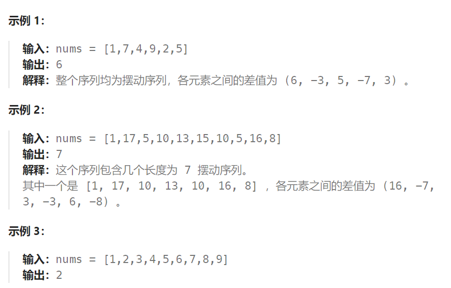

## 题目

如果连续数字之间的差严格地在正数和负数之间交替，则数字序列称为 **摆动序列 。**第一个差（如果存在的话）可能是正数或负数。仅有一个元素或者含两个不等元素的序列也视作摆动序列。

- 例如， `[1, 7, 4, 9, 2, 5]` 是一个 **摆动序列** ，因为差值 `(6, -3, 5, -7, 3)` 是正负交替出现的。
- 相反，`[1, 4, 7, 2, 5]` 和 `[1, 7, 4, 5, 5]` 不是摆动序列，第一个序列是因为它的前两个差值都是正数，第二个序列是因为它的最后一个差值为零。

**子序列** 可以通过从原始序列中删除一些（也可以不删除）元素来获得，剩下的元素保持其原始顺序。

给你一个整数数组 `nums` ，返回 `nums` 中作为 **摆动序列** 的 **最长子序列的长度** 。



## 题解

### 方法一：动态规划

```go
func wiggleMaxLength(nums []int) int {
    // 动态规划就是用解决"最长递增子序列"的方法
    // dp[i][0]: 以 nums[i] 作为山谷的摆动序列长度
    // dp[i][1]: 以 nums[i] 作为山峰的摆动序列长度
    dp := make([][2]int, len(nums))
    dp[0][0], dp[0][1] = 1,1
    maxLen := 1
    for end := 1; end < len(nums); end++ {
        cur := nums[end]
        // 计算 dp[i][0]
        for lastEnd := 0; lastEnd < end; lastEnd++ {
            if nums[lastEnd] > cur {  // 构成山谷
                dp[end][0] = getMax(dp[end][0], dp[lastEnd][1] + 1)
            }
        }
        // 计算 dp[i][1]
        for lastEnd := 0; lastEnd < end; lastEnd++ {
            if nums[lastEnd] < cur {  // 构成山峰
                dp[end][1] = getMax(dp[end][1], dp[lastEnd][0] + 1)
            }
        }
        maxLen = getMax(maxLen, getMax(dp[end][0], dp[end][1]))
    }
    return maxLen
}
func getMax(a, b int) int {
    if a > b {
        return a
    } else {
        return b
    }
}
```

### 方法二：贪心算法

本题要求通过从原始序列中删除一些（也可以不删除）元素来获得子序列，剩下的元素保持其原始顺序。

来分析一下，要求删除元素使其达到最大摆动序列，应该删除什么元素呢？

用示例二来举例，如图所示：


每次对 nums[i] 进行判断：

1. 如果其满足"峰值"或"谷值"的特点，就将其保留；
2. 如果不满足（也就是说 nums[i] 在单调斜坡或者平坡上），意味着将其从原始序列中删除

#### 斜坡：斜坡只保留起点和终点


#### 平坡：平坡只需保留起点和终点的一个即可(假设只保留终点)


#### 斜坡 + 平坡：只保留终点和起点


这里的贪心策略就是：让序列有尽可能多的局部峰值，剔除掉那些左右变化趋势相同的数字

```go
func wiggleMaxLength(nums []int) int {
    if len(nums) <= 1 {
        return len(nums)
    }
    n := len(nums)

    rearDiff := 0  // 后方差 nums[i+1] - nums[i]   记录着nums[i]右侧的变化趋势
    frontDiff := 0  // 前方差 nums[i] - nums[i-1]  记录着nums[i]左侧的变化趋势
    resLen := 1   // nums[n-1] 自动视为一个峰值(可能是山峰, 也可能是山谷)

    // 对于 nums[0] 来说， frontDiff 就是 0
    for i := 0; i < n-1 ; i++ {   // 只遍历到 nums[n-2]
        rearDiff = nums[i+1] - nums[i]
        if frontDiff <= 0 && rearDiff > 0 {   // nums[i] 是山谷  nums[i-1] >= nums[i] < nums[i+1]
            resLen++
            frontDiff = rearDiff  // 记录变化趋势(递增 or 递减)
        } else if frontDiff >= 0 && rearDiff < 0 {   // 山峰  nums[i-1] <= nums[i] > nums[i+1]
            resLen++
            frontDiff = rearDiff  // 记录变化趋势
        }
        // 当且仅当 nums[i] 左右侧变化趋势不一致时, 才会执行 frontDiff = rearDiff
        // 左右变化趋势相同的 nums[i] 统统都被从结果子序列中删除掉了
    }
    return resLen
}
```

