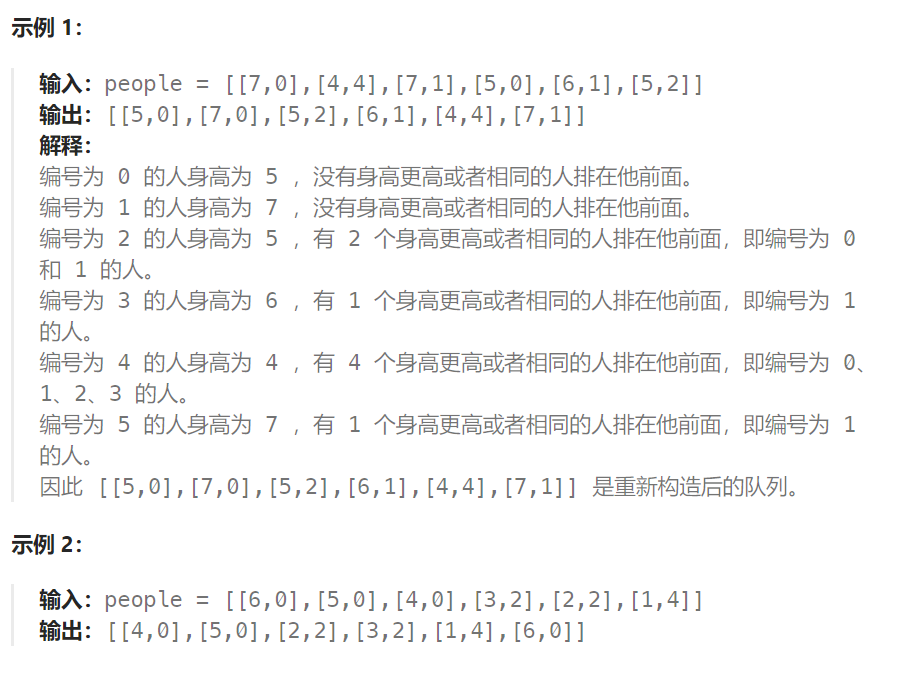

## 题目

假设有打乱顺序的一群人站成一个队列，数组 `people` 表示队列中一些人的属性（不一定按顺序）。每个 `people[i] = [hi, ki]` 表示第 `i` 个人的身高为 `hi` ，前面 **正好** 有 `ki` 个身高大于或等于 `hi` 的人。

请你重新构造并返回输入数组 `people` 所表示的队列。返回的队列应该格式化为数组 `queue` ，其中 `queue[j] = [hj, kj]` 是队列中第 `j` 个人的属性（`queue[0]` 是排在队列前面的人）。



## 题解

本题有两个维度，h和k，看到这种题目一定要想如何确定一个维度，然后再按照另一个维度重新排列。

首先按照身高h来排序呢，身高一定是从大到小排（身高相同的话则k小的站前面），让高个子在前面。

**此时我们可以确定一个维度了，就是身高，前面的节点一定都比本节点高！**

接下来，只需要针对排序后的切片，从头到尾遍历，并且按照当前 people 的k为下标插入到要返回的结果队列中就可以了。

以图中{5,2} 为例：


我们从左向右遍历 people 切片，将其中的 people 插入到结果队列中。

{5,2} 之前的所有 people 的身高都是 大于等于 它的，而我们想要 {5,2} 前面只有 2 个人的身高 大于等于 它，因此只需要将 {5,2} 插入到结果队列的下标为 2 的地方即可.

在排序后的 people 切片中，`people[h][k]` 前面身高 >= h 的人数一定 >= k ，否则队列不可能被重建。

**局部最优：优先按身高高的people的k来插入。插入操作过后的people满足队列属性**

**全局最优：最后都做完插入操作，整个队列满足题目队列属性**

```go
func reconstructQueue(people [][]int) [][]int {
    sort.Slice(people, func(i, j int) bool {
        if people[i][0] > people[j][0] {  // 按照身高降序排序
            return true
        } else if people[i][0] == people[j][0] && people[i][1] < people[j][1] {
            // 身高相同的时候按照 k 升序排序
            return true
        } else {
            return false
        }
    })
    q := make([][]int, 0)
    for i := 0; i < len(people); i++ {
        pos := people[i][1]   // 要插入到队列 q 中的位置
        if pos == 0 {
            q = append([][]int{people[i]}, q... )
        } else {
            q = append(q[:pos], append([][]int{people[i]}, q[pos:]...)...)
        }
    }
    return q
}
```

