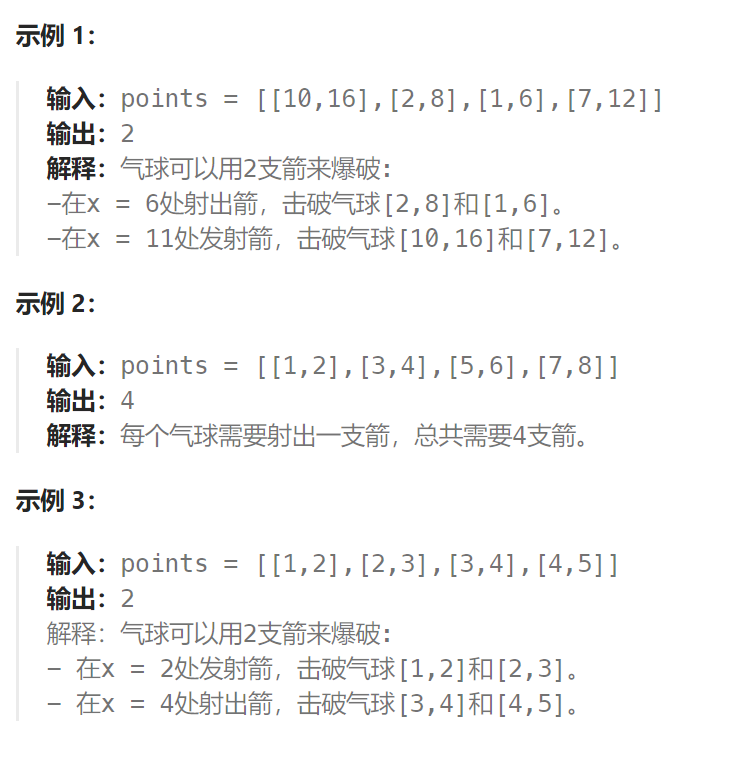

## 题目

有一些球形气球贴在一堵用 XY 平面表示的墙面上。墙面上的气球记录在整数数组 `points` ，其中`points[i] = [xstart, xend]` 表示水平直径在 `xstart` 和 `xend`之间的气球。你不知道气球的确切 y 坐标。

一支弓箭可以沿着 x 轴从不同点 **完全垂直** 地射出。在坐标 `x` 处射出一支箭，若有一个气球的直径的开始和结束坐标为 `xstart`，`xend`， 且满足  `xstart ≤ x ≤ xend`，则该气球会被 **引爆** 。可以射出的弓箭的数量 **没有限制** 。 弓箭一旦被射出之后，可以无限地前进。

给你一个数组 `points` ，*返回引爆所有气球所必须射出的 **最小** 弓箭数* 。



## 题解

```go
func findMinArrowShots(points [][]int) int {
    sort.Slice(points, func(i, j int) bool {
        if points[i][0] < points[j][0] {   // 按照 start 升序排序
            return true
        } else if points[i][0] == points[j][0] && points[i][1] < points[j][1] {  // start一样,按照end升序排序
            return true
        } else {
            return false
        }
    })
    res := 1   // 需要的弓箭数(默认射向第一个气球)
    lastArr := points[0][1]   // 上一个弓箭的位置
    for i := 1; i < len(points); i++ {
        curB := points[i]

        if curB[0] > lastArr {   // 当前气球在上一被射气球的右侧，不重叠(总是射向气球的右边界)
            lastArr = curB[1]   // 当前气球成为新的被射气球(新弓箭的位置)
            res++
        } else {  // 当前气球与上一被射气球重叠
            lastArr = getMin(lastArr, curB[1]) // 弓箭总是射向重叠气球中具有最小右边界的气球的右边界
        }

    }
    return res
}
func getMin(a, b int) int {
    if a < b {
        return a
    } else {
        return b
    }
}
```

