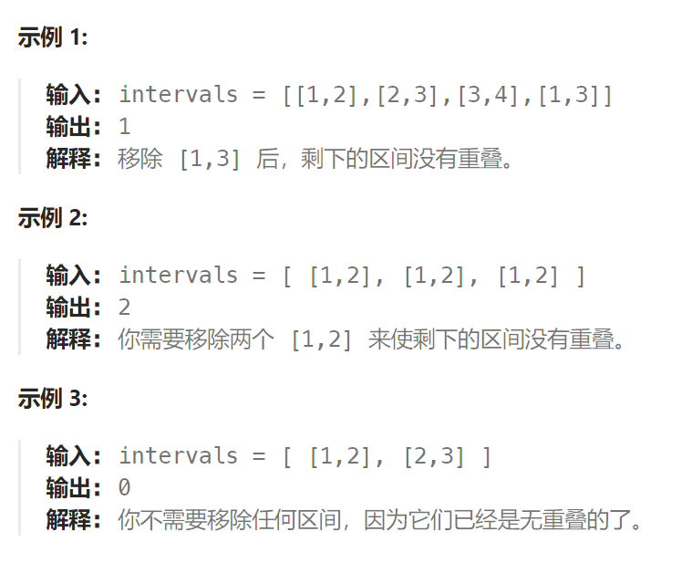

## 题目

给定一个区间的集合 `intervals` ，其中 `intervals[i] = [starti, endi]` 。返回 *需要移除区间的最小数量，使剩余区间互不重叠* 。



## 题解

1. 按照区间的左边界大小进行升序排序
2. 如果当前区间的左边界 < 上一保留区间的右边界，说明存在重叠。我们需要从这两个区间中删除具有最小右边界的那一个。更新上一个保留区间的右边界
3. 如果当前区间的左边界 >= 上一保留区间的右边界，说明两个区间没有重叠。更新上一个保留区间的右边界。

这里的贪心策略是：如果遇到两个存在重叠的区间，优先删除占据范围更大的那一个。因此，具有更大右边界的区间就被删除掉了。

```go
func eraseOverlapIntervals(intervals [][]int) int {
    sort.Slice(intervals, func(i, j int) bool {
        return intervals[i][0] < intervals[j][0]   // 按照左边界升序排序
    })
    lastRight := intervals[0][1]  // 上一个保留区间的右边界
    res := 0   // 要删除的区间个数
    for i := 1; i < len(intervals); i++ {
        cur := intervals[i]
        if cur[0] >= lastRight {  // 此区间与上一区间不重叠
            lastRight = cur[1]
        } else {    // 此区间与上一区间重叠
            lastRight = getMin(lastRight, cur[1])   // 保留具有更小右边界的区间
            res++   // 右边界更大的区间被删除
        }
    }
    return res
}
func getMin(a, b int) int {
    if a < b {
        return a
    } else {
        return b
    }
}
```

