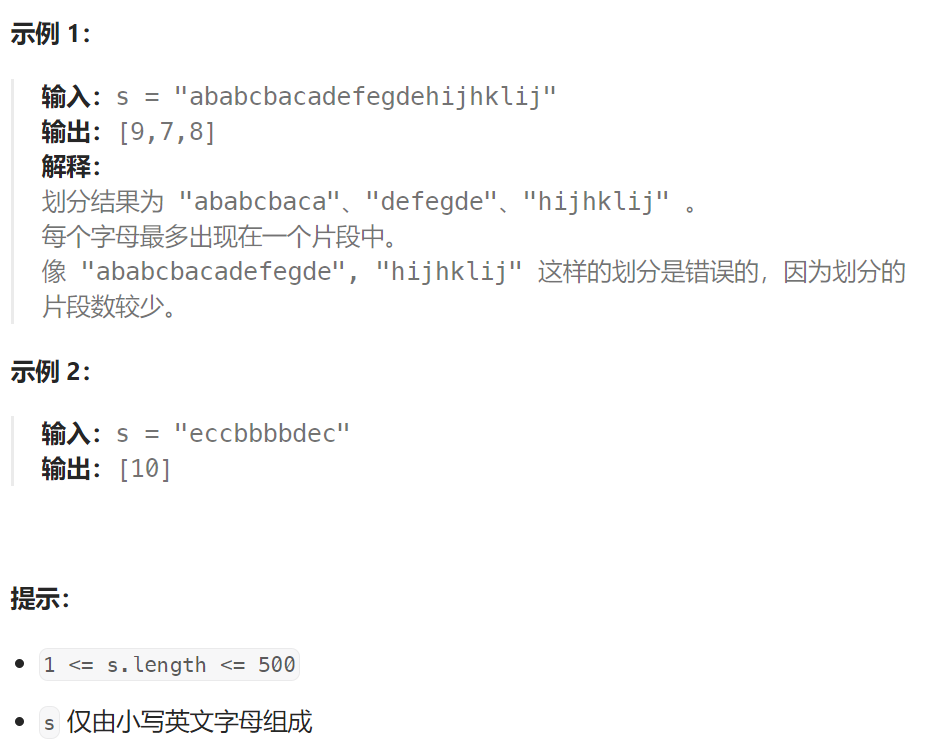

## 题目

给你一个字符串 `s` 。我们要把这个字符串划分为尽可能多的片段，同一字母最多出现在一个片段中。

注意，划分结果需要满足：将所有划分结果按顺序连接，得到的字符串仍然是 `s` 。

返回一个表示每个字符串片段的长度的列表。



## 题解

```go
func partitionLabels(s string) []int {
    charFar := make([]int, 26)  // 记录每一个字符出现的最远位置

    for i := 0; i < len(s); i++ {
        char := s[i]
        charFar[char - 'a'] = i
    }

    end := charFar[s[0] - 'a']   // 当前片段的终点。 初始为: 字符 s[0] 最后一次出现的位置
    start := 0   // 当前片段的起点
    res := make([]int, 0)

    for i := 0; i < len(s); i++ {   // 还要再次从0开始检验，原因是: 第一个字符可能自己就属于一个片段
        char := s[i]
        end = getMax(end, charFar[char - 'a'])   // 期间可能遇到字符具有更远的最后出现位置, 那么片段终点就要更新

        if i == end {   // 到达了片段终点, 此处即为一个分割点
            res = append(res, end - start + 1)   // 存储上一片段长度
            start = i+1   // 开启一个新片段
        }
    }
    return res
}
```

